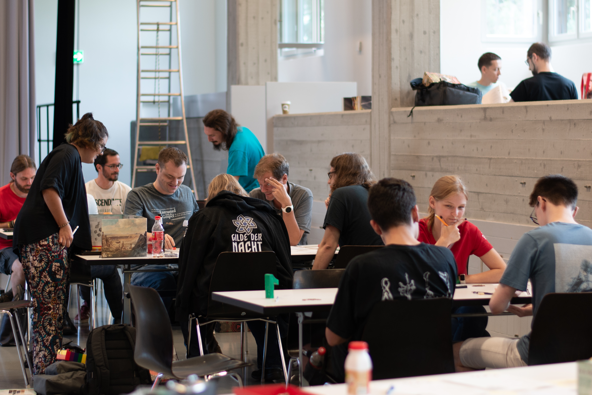

import { Box } from "../../common/components/Box.tsx";
import { BoxGrid } from "../../common/components/BoxGrid.tsx";
import { Slider } from "../../common/components/Slider.tsx";

<Box type="success" link="/en" linkLabel="take me to the English summary">
  Looking for a short and sweet overview in English?
</Box>

# Herzlich willkommen

<Box type="special">
  Die Luzerner Rollenspieltage kehren 2024 zurück: 24. bis 25. August 2024
</Box>

Am **26. und 27. August 2023** werden ganz unterschiedliche Rollenspielrunden angeboten – für alle, die einmal in die Welt der Rollenspiele reinschnuppern möchten aber auch für erfahrene Spieler:innen, die Neues ausprobieren möchten.

<Slider>

</Slider>

<BoxGrid>

  <Box type="success" link="/neueinsteiger" linkLabel="für Neueinsteiger">
    Hast du bisher **noch keine oder wenig Erfahrung** mit Rollenspielen sammeln dürfen, dann haben wir für dich eine Seite zusammengestellt.
  </Box>

  <Box type="special" link="/familien" linkLabel="für Familien">
    Seid ihr eine **Familie mit Kindern**, dann lest bitte hier weiter.
  </Box>

  <Box type="gray" link="/spielleiterinnen" linkLabel="für Spielleiter">
    Du möchtest gerne eine oder mehrere Spielrunden **leiten**, dann bist du hier an der richtigen Stelle.
  </Box>

  <Box type="danger" link="/veteranen" linkLabel="für Veteranen">
    Du hast schon so einiges erlebt, möchtest gerne was Neues ausprobieren und deinen Horizont erweitern?
  </Box>

</BoxGrid>

## Die wichtigsten Informationen auf einen Blick

### Öffnungszeiten

Samstag, 10 bis 24 Uhr \
Sonntag, 10 bis 17 Uhr

## Eintritt & Anmeldung

Der Eintritt ist kostenfrei. Voranmeldungen wurden am 10. August geschlossen.

Für spontane Spieler:innen werden wir einige freie Plätze zur Verfügung haben. 

## Anreise

Die Adresse lautet: [Pfarrei St. Johannes, Schädrütistrasse 26, 6006 Luzern](https://www.google.com/maps/place/Katholische+Pfarrei+St.+Johannes+Luzern+-+W%C3%BCrzenbach/@47.0557335,8.3467125,18z/data=!4m5!3m4!1s0x478ffbe4a1717e11:0x63ba1cf90c4e4c46!8m2!3d47.055803!4d8.3448403)

Vom Bahnhof Luzern sind die Räumlichkeiten bequem in 15 Minuten erreichbar per **Bus 8** (Aussteigen an der _Würzenbachmatte_ Haltestelle) oder **Bus 14** (Aussteigen an der _Schlösslirain_ Haltestelle).

Eine (kostenpflichtige) Parkgarage befindet sich 5 Gehminuten entfernt. Gehört zur Migros an der Adresse [Würzenbachstrasse 19, Luzern](https://www.google.com/maps/place/Migros+Supermarkt/@47.0548083,8.3433408,18.5z/data=!4m5!3m4!1s0x478ffb4e3b438fcf:0x44bae0889972cca5!8m2!3d47.0550141!4d8.3437071).

## Verpflegung

Ein Kiosk steht während den Öffnungszeiten zur Verfügung und am Mittag und am Abend kochen wir etwas Leckeres für euch.

## Rahmenprogramm

Neben den Rollenspielrunden wird es auch die Möglichkeit geben, **Brettspiele** zu spielen und Spiele und Spielzubehör auf dem **Flohmarkt** zu kaufen und zu verkaufen.
