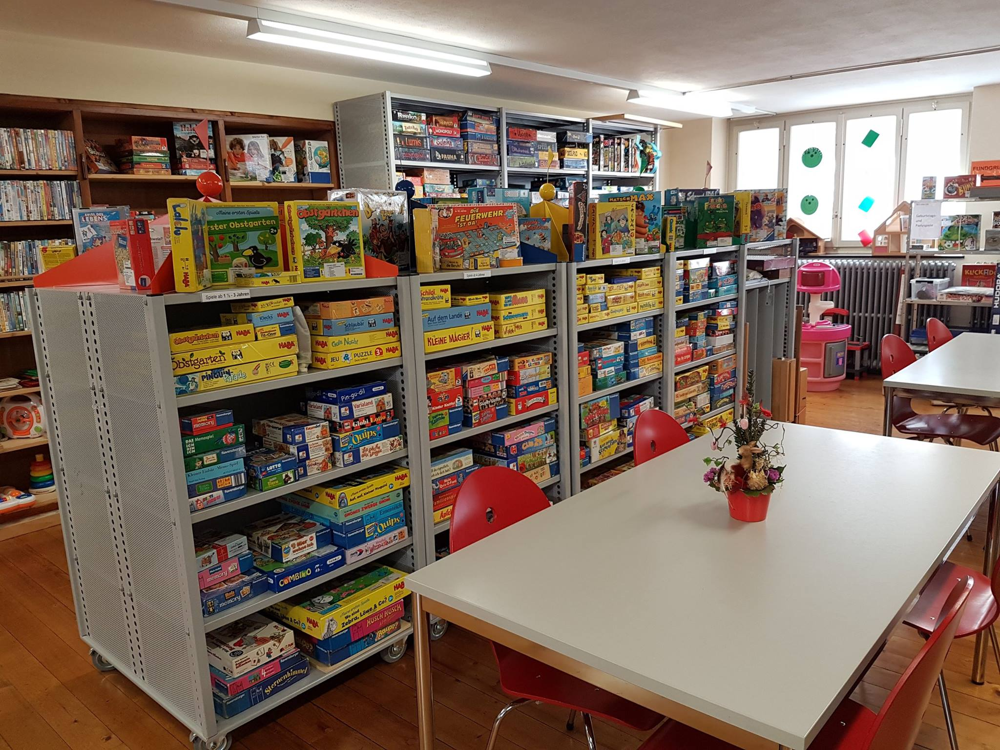
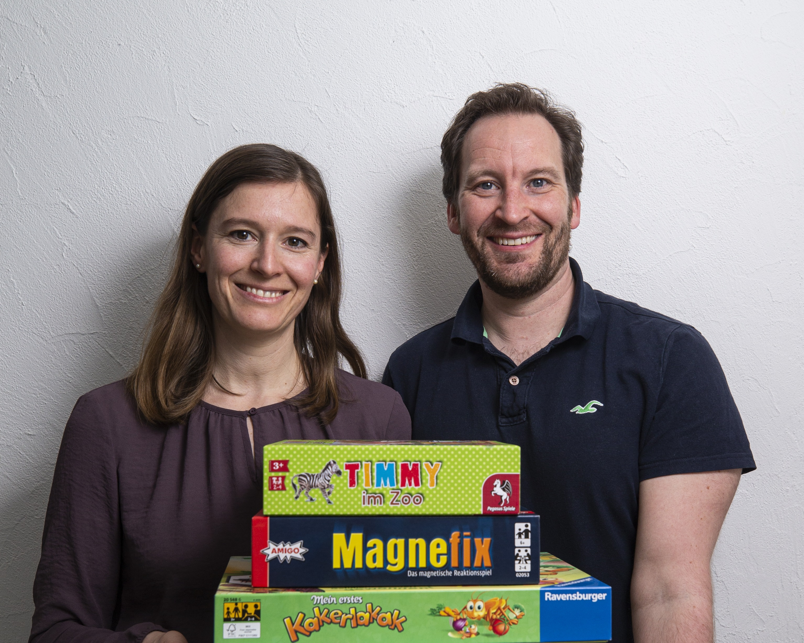
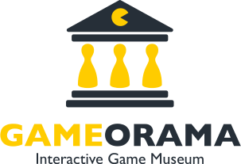
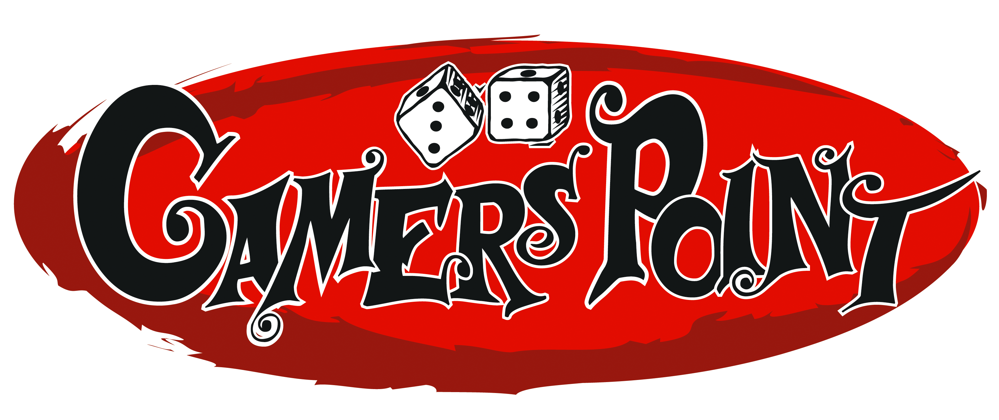

import { ButtonLink } from "@common/components/ButtonLink.tsx";
import { ImageText, ImageTextLeft, ImageTextRight } from "@common/components/ImageText.tsx";

## Ludothek Luzern

<ImageText kind="partner">

<ImageTextLeft>

</ImageTextLeft>

<ImageTextRight>

Kinder und Erwachsene haben die Möglichkeit in unserer Ludothek neue Spiele und Spielgeräte zu kleinem Preis auszuleihen. 
Das Angebot richtet sich an alle, die sich nicht immer neue Spiele anschaffen wollen oder können. 

unsere Adresse ist Ludothek Luzern, Bruchstrasse 78, 6003 Luzern

_Unsere Kolleginnen und Kollegen von der Ludothek bringen Spiele für die ganze Familie mit und werden diese am Sonntag, ab 10 Uhr gerne unseren jüngsten Spieler:innen erklären._

<ButtonLink link="https://www.ludothek-luzern.ch" label="Ludothek Luzern" />

</ImageTextRight>

</ImageText>

## Spielbude Zug

<ImageText kind="partner">

<ImageTextLeft>

</ImageTextLeft>

<ImageTextRight>

«Spielbude Zug (Denise und Yves Hess): Motiviert durch unsere Passion für die Welt der Spiele konnten wir 2015 die ersten Spieleschulungen für sechs Zuger Ludotheken durchführen. Es folgten Spielanlässe mit verschiedenen Gastropartner und Firmenevents, u. a. die Zuger Spielnacht und das Spielschiff auf dem Zugersee. In der Zwischenzeit bieten wir zusätzlich Weiterbildungen für Lehrpersonen an und entwickeln unser Konzept "Spielend lernen" stetig weiter.»

Unsere Kolleginnen und Kollegen von Zug bringen Spiele für die ganze Familie mit und werden diese am Sonntag, ab 10 Uhr gerne unseren jüngsten Spieler:innen erklären.

<ButtonLink link="https://www.zugerspielnacht.ch/spielbudezug" label="Spielbude Zug" />

</ImageTextRight>

</ImageText>

## Gameorama &ndash; Interaktives Spielmuseum

<ImageText kind="partner">

<ImageTextLeft>

</ImageTextLeft>

<ImageTextRight>

Das Gameorama in Luzern ist das einzige interaktive Spielmuseum der Schweiz. Das Gameorama bewahrt, präsentiert und vermittelt Exponate aus den Bereichen Gesellschaftsspiele, Spielautomaten und Videospiele.

Das Gameorama organisiert am Sonntag, um 14 Uhr das Qualifikationsturnier für die KLASK-Schweizermeisterschaft.

<ButtonLink link="https://www.gameorama.ch/" label="Gameorama" />

</ImageTextRight>

</ImageText>

## Gamers Point

<ImageText kind="partner">

<ImageTextLeft>

</ImageTextLeft>

<ImageTextRight>

Die kirchliche Jugendarbeit bietet mit dem GAMERS POINT einen Treff an, welcher kreative Jugendliche anspricht, die sonst gerne daheim an ihrem Computer gamen. Der GAMERS POINT setzt den Fokus nicht auf Computerspiele, sondern bietet eine riesige Sammlung von anspruchsvollen Gesellschaftspielen an.

<ButtonLink link="https://www.gamerspoint.ch/" label="Gamers Point" />

</ImageTextRight>

</ImageText>
