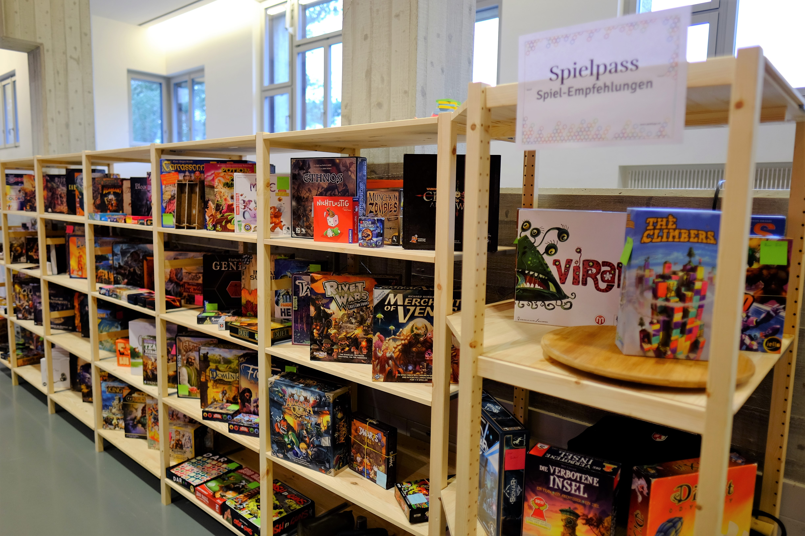
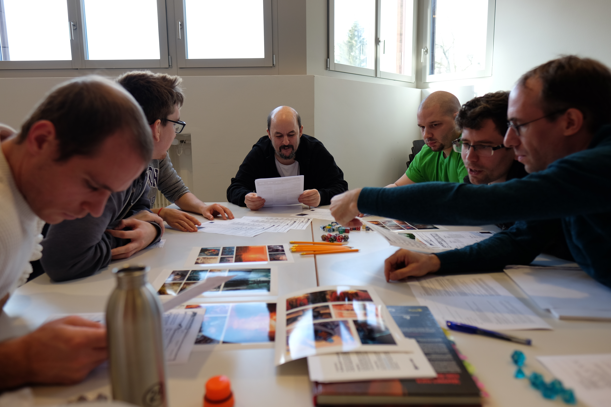
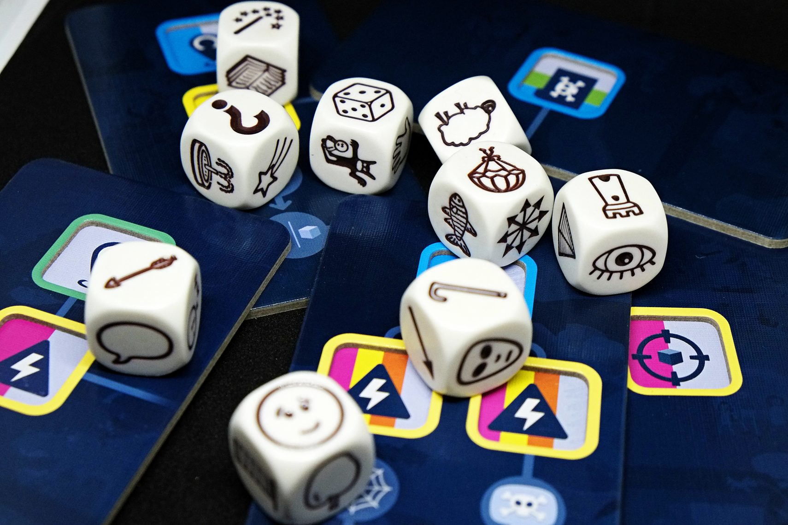
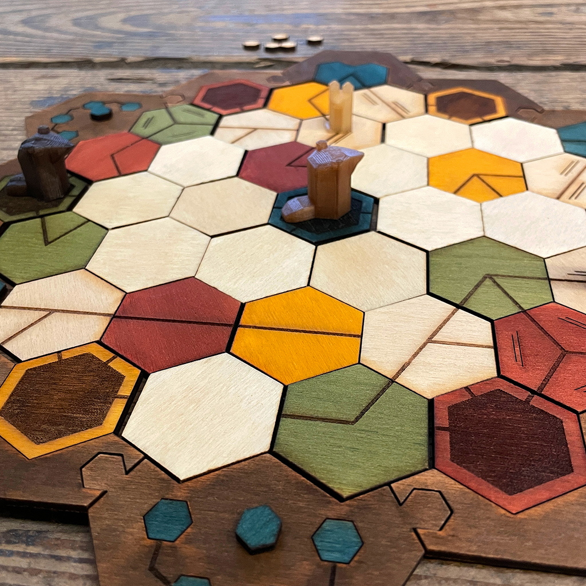

import { Box } from "@common/components/Box.tsx";
import { BoxGrid } from "@common/components/BoxGrid.tsx";
import { ButtonLink } from "@common/components/ButtonLink.tsx";
import { ImageText, ImageTextLeft, ImageTextRight } from "@common/components/ImageText.tsx";

# Programm

**Öffnungszeiten**

Samstag, 22. März 2025, 10 bis 24 Uhr.\
Sonntag, 23. März 2025, 10 bis 18 Uhr.

Für ein abwechslungsreiches Programm ist an den Luzerner Spieltagen gesorgt:

<BoxGrid>

<Box type="success" link="/programm/neue-besucher" linkLabel="für neue Besucher">
  Hier kriegst du eine gute Übersicht, was dich an den Luzerner Spieltagen erwarten kann.
</Box>

<Box type="special" link="/programm/familien" linkLabel="für Familien">
  Am Sonntag bieten wir vieles für die kleinsten Spieler:innen an. Klicke hier, um mehr zu erfahren.
</Box>

<Box type="danger" link="/programm/neuerungen" linkLabel="für Wiederkehrende">
  Für wiederkehrende Besucher haben wir hier eine Liste mit allen Neuerungen zusammengestellt.  
</Box>

</BoxGrid>

## Spiele-Bibliothek

_Samstag + Sonntag_

<ImageText>

<ImageTextLeft>

</ImageTextLeft>

<ImageTextRight>

Die grosse Bibliothek mit Spielen für Jung und Alt, für Strategen und Geniesser, für Einzel- oder Teamkämpfer steht im Fokus des Anlasses – entdecke mit uns Spiele, welche wir dir vor Ort erklären, ohne dass du das Regelbuch in die Hand nehmen musst.

</ImageTextRight>

</ImageText>

## Erklärbären / Spielempfehlungen

_Samstag + Sonntag_

<ImageText>

<ImageTextLeft>

</ImageTextLeft>

<ImageTextRight>

Wir haben dieses Jahr wieder eine Auswahl an Spielen, welche Erklärbären und Erklärbärinnen aus dem Effeff beherschen. Sieh dich nach den roten T-Shirts um, melde dich am Infopoint oder stöbere selber in unserer Bibliothek.

</ImageTextRight>

</ImageText>

## Flohmarkt

_Samstag + Sonntag_

<ImageText>

<ImageTextLeft>

</ImageTextLeft>

<ImageTextRight>

Du möchtest deine persönliche Spielesammlung aufstocken? Kein Problem, stöbere in unserem Flohmarkt.

Oder mache andern eine Freude indem du selbst Spiele anbietest welche du sowieso nicht mehr spielst. Der Flohmarkt wird von uns betreut und du kannst einfach sobald du gehst die übrig gebliebenen Spiele wieder abholen.

_10% des Flohmarkt-Umsatzes gehen in die Vereinskasse der Organisatoren ([Gilde der Nacht](https://gildedernacht.ch/)) (Verkäufe von Vereinsmitglieder ausgenommen)._

**Hast du vor mehr als fünf Spiele zu bringen? Dann trag dich doch bitte in diese Liste ein:**

<ButtonLink link="https://w0hbjqpl.forms.app/luzerner-spieltage-2025-flohmarkt-spiele-vorbereiten" label="Flohmarkt Voranmeldung" />

</ImageTextRight>

</ImageText>

## KLASK-Turnier
_Samstag 14:00 Uhr | Sonntag 14:00 Uhr_

<ImageText>

<ImageTextLeft>

Organisiert vom Gameorama, dem interaktiven Spielmuseum in Luzern.

<ButtonLink link="https://www.gameorama.ch/" label="Gameorama" />

</ImageTextLeft>

<ImageTextRight>

Bereits zum vierten Mal findet eines der Qualifikationsturniere für die KLASK-Schweizermeisterschaft an den Luzerner Spieltagen statt. Aufgrund der grossen Beliebtheit dieses Jahr gleich zweimal! Das Turnier ist für neue Spieler und Veteranen geeignet. Die Regeln sind einfach und kurz. Mitmachen ist gratis und die besten können sich sogar für die KLASK-Schweizermeisterschaft qualifizieren.

Eine Anmeldung ist empfohlen - pro Tag gibt es 20 Plätze:

<ButtonLink link="/anmeldung" label="Zur Anmeldung" />

</ImageTextRight>

</ImageText>

## Organisierte Spiele

_Samstag + Sonntag spezifische Zeiten_

<ImageText>

<ImageTextLeft>

</ImageTextLeft>

<ImageTextRight>

An beiden Tagen werden auch Spiele veranstaltet, die für Action und Spannung stehen. Komplexe, tumultreiche oder Spiele mit hoher Spieleranzahl finden so ihren Platz.

* Twilight Imperium, Samstag 10:00  | 8 Plätze
* Monster Hunter, Samstag 16:00 | 2x 4 Plätze
* Blood on the Clock Tower, Samstag 20:00 | 14 Plätze
* Challengers!, Sonntag 10:30 | 2x 8 Plätze

Aufgrund der limitierten Platzzahl ist eine Voranmeldung empfohlen:

<ButtonLink link="/anmeldung" label="Zur Anmeldung" />

</ImageTextRight>

</ImageText>

## Rollenspiele

_Samstag, 22. März 2025_

<ImageText>

<ImageTextLeft>

_Beispiele der Rollenspiele: How to be a Hero, Tales from the Loop, Fiasco und Untold._

</ImageTextLeft>

<ImageTextRight>

Tauche mit uns ein in die unendliche Welt der Phantasie, wo wir gemeinsam einzigartige Geschichten erleben werden. Wundervolle Geschichten, die wir zusammen spinnen und ab und zu Entscheidungen dem Glück überlassen, damit wir uns immer wieder von neuem überraschen und unterhalten lassen können.

Wenn du noch nie sogenannte Pen-&-Paper-Rollenspiele gespielt hast, wirst du bei uns Spielleiter finden, die dich in deinen ersten Schritten in diesem kreativen Hobby mit grossem Engagement unterstützen werden.
</ImageTextRight>

</ImageText>

## Rollenspiele für Familien

_Sonntag, 23. März 2025_

<ImageText>

<ImageTextLeft>

_Beispiele der Rollenspiele: Fabelwelten, Es war einmal, Fabula Rasa Seemansgarn und Naeandis ._

</ImageTextLeft>

<ImageTextRight>

Tauche als Familie mit Kindern jeden Alters ein in die Welt der Phantasie und des Geschichtenerzählens. Wir haben einfache Einstiege vorbereitet, um in minutenschnelle zu starten.

Mehr Informationen haben wir [in diesem Artikel](https://gildedernacht.ch/artikel/familientisch/) für euch zusammengestellt.

</ImageTextRight>

</ImageText>

## Kinderspiele ab 3 Jahren

_Sonntag, 23. März 2025_

<ImageText>

<ImageTextLeft>

</ImageTextLeft>

<ImageTextRight>

Unsere Kolleginnen und Kollegen von der Spielbude Zug und Ludothek Luzern bringen Spiele für die ganze Familie mit und werden diese gerne unseren jüngsten Spieler:innen erklären. Eine super Gelegenheit, um neue Spiele kennen zu lernen.

Unterstützt durch die Spielbude Zug und Ludothek Luzern.

<ButtonLink link="https://www.ludothek-luzern.ch" label="Ludothek Luzern" />
<ButtonLink link="https://www.zugerspielnacht.ch/spielbudezug" label="Spielbude Zug" />

</ImageTextRight>

</ImageText>

## Verpflegung / Kiosk

_Samstag + Sonntag_

<ImageText>

<ImageTextLeft>

</ImageTextLeft>

<ImageTextRight>

Ein Kiosk mit Getränken und Snacks steht während den Öffnungszeiten zur Verfügung und am Mittag und am Abend kochen wir etwas Leckeres für euch, inkl. Optionen für Veganer.

Wir kochen auf **Vorbestellungen**, welche wir vor Ort aufnehmen werden. Gib bitte für das Mittagessen bis 11 Uhr und für das Nachtessen (am Samstag) bis 17 Uhr an der Kasse deine Bestellung auf.

_Speisen und Getränke können Bar oder per Twint bezahlt werden._

</ImageTextRight>

</ImageText>

## Spieldesigner «Lamalandstudios»

_Samstag_

<ImageText>

<ImageTextLeft>

</ImageTextLeft>

<ImageTextRight>
  «Lamaland Studios», so nennen wir uns, Dodo & Mely, zwei Game Design Alumni mit Sitz in Winterthur und im Sommer auch mal am See.
  
  Noch sind wir mit «Badger», unserem ersten Brettspiel, in der Entwicklungsphase. Doch kurz bevor wir unaufhaltsam mit unserer handgemachten Produktion durchstarten, wollen wir euch an den Luzerner Spieletagen nochmal die Chance bieten, uns euer Feedback zu geben. Keine Sorge, wir spucken auch nicht, wir sind handzahme Lamas.
  
<ButtonLink link="https://www.lamalandstudios.com/" label="Lamalandstudios" />

</ImageTextRight>

</ImageText>

## Spieldesigner «Sheepnappers»

_Samstag + Sonntag_

<ImageText>

<ImageTextLeft>

</ImageTextLeft>

<ImageTextRight>
  Als Naimad nach dem Erwachen aus dem Fenster schaut, fallen ihm fast die Fühler vom Kopf. Eine weisse Schicht bedeckt den sonst rötlichen Boden seines Heimatplaneten. Es wird kalt in der Galaxis, und da hilft nur eines: Warme Pullis! Zwei bis vier sheepnappende Alienkolonien machen sich auf den Weg, um dem Planeten der Schlafschafe einen Besuch abzustatten. Sammelt Magic Juice™, damit eure Schrottkisten überhaupt wieder abheben können. Nervt einander gehörig mit Kamikazeschafen und Zeitmaschinen. Und wägt gut ab, wann ihr den Abflug wagen wollt – denn der Wolf hat auch noch ein Wörtchen mitzureden..
  
<ButtonLink link="https://www.sheepnappers.com/" label="«Sheepnappers»" />

</ImageTextRight>

</ImageText>

## Spieldesigner «Project X – Die Menschheit vor der Apokalypse»

_Samstag, 10 Uhr - 16 Uhr | Sonntag 13 Uhr - 16 Uhr_

<ImageText>

<ImageTextLeft>

</ImageTextLeft>

<ImageTextRight>

Bist du bereit, die Zukunft der Menschheit zu retten? Auf den Luzerner Spieltagen hast du die exklusive Gelegenheit, Project X – einen innovativen Brettspiel-Prototypen – zu testen! Noch vor der Verlagspräsentation kannst du das Spiel hautnah erleben, mitgestalten und mit deinem Feedback den letzten Feinschliff geben.

Ein gewaltiger Asteroid rast auf die Erde zu – die Zeit ist knapp! Jeder Spieler übernimmt die Leitung eines Rettungsprojekts mit dem Ziel, die Menschheit ins All zu evakuieren. Doch die Ressourcen sind begrenzt, und der Technologiemarkt verändert sich stetig. Wer clever neue Technologien entwickelt, sie strategisch einsetzt und sein Projekt am besten optimiert, maximiert die Erfolgschancen – und gewinnt!

Project X ist ein Kennerspiel für 2 – 4 Personen, ab 10 Jahren. Das Spiel dauert ca. 20–30 Min. pro Person.

  Florian Schwegler bietet zu fixen Zeiten Spielrunden an:
  * Runde 1: Sa 10:30 
  * Runde 2: Sa 13:30
  * Runde 3: So 13:00

</ImageTextRight>

</ImageText>

<Box type="success" link="https://gildedernacht.ch/" linkLabel="Zur Gilde der Nacht">
  Ist dir das zu wenig Programm? Dann schau doch bei der Gilde der Nacht rein, den Organisatoren der Luzerner Spieltage.  Und merk dir unbedingt das Datum fürs nächste Jahr: **14. + 15. März 2026**.
</Box>
