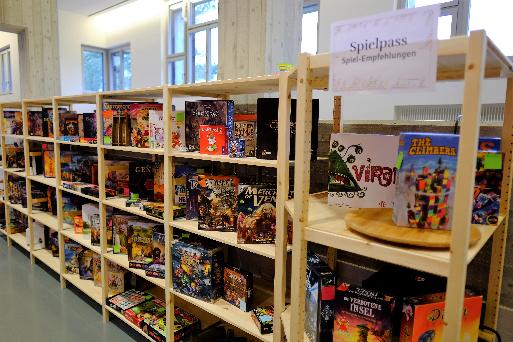
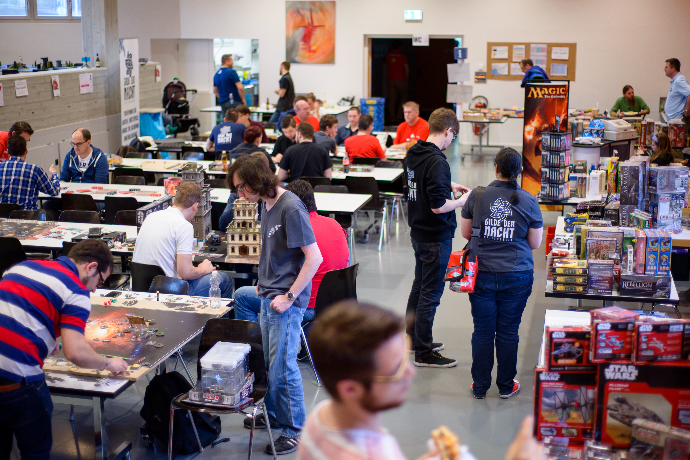

import { Box } from "@common/components/Box.tsx";
import { BoxGrid } from "@common/components/BoxGrid.tsx";
import { ButtonLink } from "@common/components/ButtonLink.tsx";
import { ImageText, ImageTextLeft, ImageTextRight } from "@common/components/ImageText.tsx";

# Neue Besucher

Das Konzept der Spieltage ist relativ simpel: Du magst Brettspiele? Dann fühlst du dich bei uns wohl.

Wir haben eine riesige Spielebibliothek zum selber rumstöbern und eine Auswahl an Spielen, die wir empfehlen. Damit du dich nicht selber in die Regeln einlesen musst, sind unsere **Erklärbären und Erklärbärinnen** zwischen den Tischen unterwegs um die Spielempfehlungen zu erklären.

Es gibt einen offenen Flohmarkt. Am Samstag kochen wir Mittag- und Nachtessen und am Sonntag Mittagessen.

**Öffnungszeiten**

Samstag, 9. März 2024, 10 bis 24 Uhr.\
Sonntag, 10. März 2024, 10 bis 18 Uhr.

## Spiele-Bibliothek

_Samstag + Sonntag_

<ImageText>

<ImageTextLeft>

</ImageTextLeft>

<ImageTextRight>

Die grosse Bibliothek mit Spielen für Jung und Alt, für Strategen und Geniesser, für Einzel- oder Teamkämpfer steht im Fokus des Anlasses – entdecke mit uns Spiele, welche wir dir vor Ort erklären, ohne dass du das Regelbuch in die Hand nehmen musst.

</ImageTextRight>

</ImageText>

## Erklärbären / Spielempfehlungen

_Samstag + Sonntag_

<ImageText>

<ImageTextLeft>

</ImageTextLeft>

<ImageTextRight>

Wir haben dieses Jahr wieder eine Auswahl an Spielen, welche Erklärbären und Erklärbärinnen aus dem Effeff beherschen. Sieh dich nach den roten T-Shirts um, melde dich am Infopoint oder stöbere selber in unserer Bibliothek.

</ImageTextRight>

</ImageText>

## Rollenspiele

_Samstag, 9. März 2024, ab 13 Uhr_

<ImageText>

<ImageTextLeft>

_Beispiele der Rollenspiele: How to be a Hero, Tales from the Loop, Fiasco und Untold._

</ImageTextLeft>

<ImageTextRight>

Tauche mit uns ein in die unendliche Welt der Phantasie, wo wir gemeinsam einzigartige Geschichten erleben werden. Wundervolle Geschichten, die wir zusammen spinnen und ab und zu Entscheidungen dem Glück überlassen, damit wir uns immer wieder von neuem überraschen und unterhalten lassen können.

Wenn du noch nie sogenannte Pen-&-Paper-Rollenspiele gespielt hast, wirst du bei uns Spielleiter finden, die dich in deinen ersten Schritten in diesem kreativen Hobby mit grossem Engagement unterstützen werden.
</ImageTextRight>

</ImageText>

## Tabletop / Miniaturspiele

_Samstag + Sonntag_

<ImageText>

<ImageTextLeft>

</ImageTextLeft>

<ImageTextRight>

In unserem Tabletop-Bereich kannst du Warhammer 40K-Luft schnuppern und mit Gleichgesinnten über Bastel- und Maltechniken plaudern.

</ImageTextRight>

</ImageText>

## Flohmarkt

_Samstag + Sonntag_

<ImageText>

<ImageTextLeft>

Hast du vor mehr als fünf Spiele zu bringen, dann trag dich doch bitte in diese Liste ein:

<ButtonLink link="https://respondto.forms.app/pascisch/luzerner-spieltage-2024-flohmarkt-spiele-vorbereiten" label="Flohmarkt Voranmeldung" />

</ImageTextLeft>

<ImageTextRight>

Du möchtest deine persönliche Spielesammlung aufstocken? Kein Problem, stöbere in unserem Flohmarkt. Die eine oder andere Perle wirst du bestimmt finden.

Oder mache andern eine Freude indem du selbst Spiele anbietest welche du sowieso nicht mehr spielst. Der Flohmarkt wird von uns betreut und du kannst einfach sobald du gehst die übrig gebliebenen Spiele wieder Abholen.

_10% des Flohmarkt-Umsatzes gehen in die Vereinskasse der Organisatoren ([Gilde der Nacht](https://gildedernacht.ch/))._

</ImageTextRight>

</ImageText>

## Verpflegung / Kiosk

_Samstag + Sonntag_

<ImageText>

<ImageTextLeft>

</ImageTextLeft>

<ImageTextRight>

Ein Kiosk mit Getränken und Snacks steht während den Öffnungszeiten zur Verfügung und am Mittag und am Abend kochen wir etwas Leckeres für euch, inkl. Optionen für Veganer.

**Warme Küche**

- Samstag, 12 - 13 Uhr
- Samstag, 18 - 19 Uhr
- Sonntag, 12 - 13 Uhr

_Speisen und Getränke können Bar oder per Twint bezahlt werden._

</ImageTextRight>

</ImageText>

## Organisierte Spiele

_Samstag, 9. März 2024_

<ImageText>

<ImageTextLeft>

</ImageTextLeft>

<ImageTextRight>

Am ganzen Samstag werden in einem separaten Raum Spiele veranstaltet, die für Action und Spannung stehen. Laute, tumultreiche oder aktive Spiele oder Spiele mit hoher Spieleranzahl finden dort ihren Platz.

Jede Spielrunde wird jeweils 5 Minuten früher über Mikrofon ausgerufen und wer Lust hat, kommt spontan dazu, ganz ohne Anmeldung. Das ist auch eine gute Gelegenheit, andere Mitspieler:innen zu finden, wenn du alleine gekommen bist.

</ImageTextRight>

</ImageText>

<Box type="success" link="/programm" linkLabel="Alle Programmpunkte">
  Vermisst du etwas? Schau doch in unsere Gesamtübersicht rein.
</Box>
