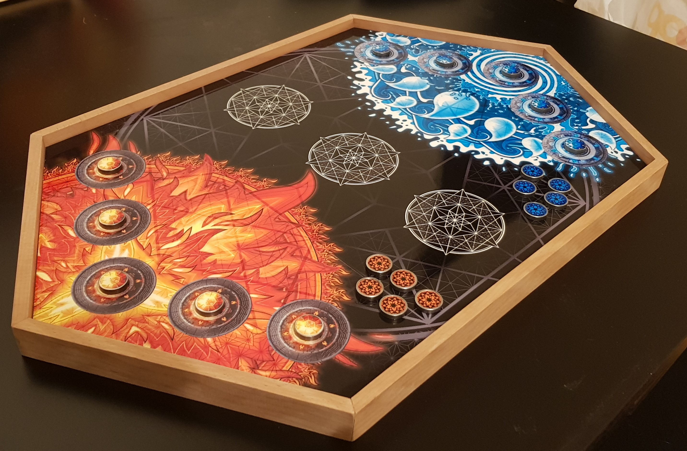
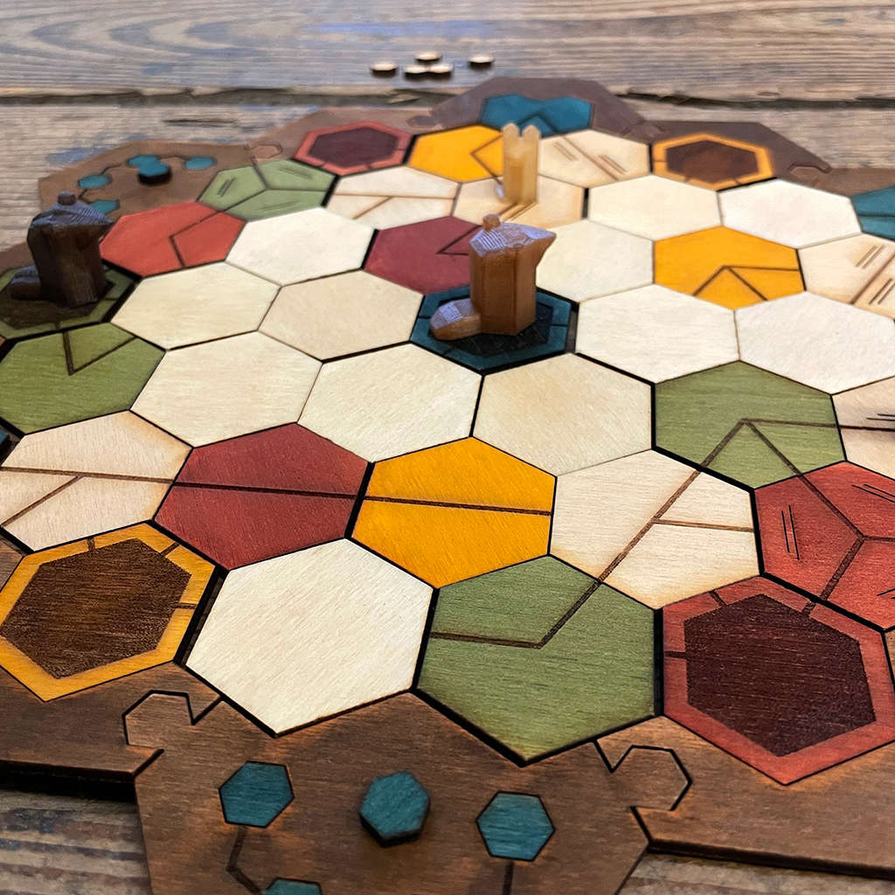

import { Box } from "@common/components/Box.tsx";
import { BoxGrid } from "@common/components/BoxGrid.tsx";
import { ButtonLink } from "@common/components/ButtonLink.tsx";
import { ImageText, ImageTextLeft, ImageTextRight } from "@common/components/ImageText.tsx";

# Neuerungen

<Box type="special">
  **Achtung,** das Programm ist noch vom letzten Jahr und wird erst Anfangs 2025 aktualisiert.
</Box>

Du kennst die Spieltage schon in und Auswendig? Dieses Jahr ist das Konzept wieder ziemlich ähnlich.

Hier folgt eine Übersicht über die neuen Programmpunkte:

## Kinderspiele ab 3 Jahren

_Sonntag, 10. März 2024_

<ImageText>

<ImageTextLeft>

Unterstützt durch die Spielbude Zug und Ludothek Luzern.

<ButtonLink link="https://www.ludothek-luzern.ch" label="Ludothek Luzern" />
<ButtonLink link="https://www.zugerspielnacht.ch/spielbudezug" label="Spielbude Zug" />

</ImageTextLeft>

<ImageTextRight>

Unsere Kolleginnen und Kollegen von der Spielbude Zug und Ludothek Luzern bringen Spiele für die ganze Familie mit und werden diese gerne unseren jüngsten Spieler:innen erklären. Eine super Gelegenheit, um neue Spiele kennen zu lernen.

</ImageTextRight>

</ImageText>

## Lange Spiele

_Samstag, 9. März 2024, 10 Uhr_

<ImageText>

<ImageTextLeft>

</ImageTextLeft>

<ImageTextRight>

Du hast Lust auf ein extrem langes Brettspiel? Komm am Samstag direkt zur Türöffnung um 10 Uhr, um in ein episches Abenteuer mit Gleichgesinnten zu starten.

Dieses Jahr haben "Twilight Imperium: Vierte Edition" dabei. Besitzt du selbst ein längeres Spiel, von dem du die Regeln erklären kannst, welches du gerne auf den Tisch bringen würdest? Nimm Kontakt mit uns auf und wir reservieren dir einen Platz.

</ImageTextRight>

</ImageText>

## Organisierte Spiele

_Samstag, 9. März 2024_

<ImageText>

<ImageTextLeft>

</ImageTextLeft>

<ImageTextRight>

Am ganzen Samstag werden in einem separaten Raum Spiele veranstaltet, die für Action und Spannung stehen. Laute, tumultreiche oder aktive Spiele oder Spiele mit hoher Spieleranzahl finden dort ihren Platz.

Jede Spielrunde wird jeweils 5 Minuten früher über Mikrofon ausgerufen und wer Lust hat, kommt spontan dazu, ganz ohne Anmeldung. Das ist auch eine gute Gelegenheit, andere Mitspieler:innen zu finden, wenn du alleine gekommen bist.

</ImageTextRight>

</ImageText>

## Spieldesigner «ScyDes»

_Samstag, 9. März 2024, ab 10 Uhr_\
_Sonntag, 10. März 2024, ab 14 Uhr_

<ImageText>

<ImageTextLeft>

<ButtonLink link="https://www.scydes.com/games" label="ScyDes" />

</ImageTextLeft>

<ImageTextRight>

Die kleine Spieleschmiede ScyDes bringt nach langem Warten endlich wieder Katapult-Action an die Spieltage!

Neben Walls of Scydonia kann auch der Prototyp des strategischen Geschicklichkeitsspiels KOR gespielt werden.

</ImageTextRight>

</ImageText>

## Spieldesigner «Lamalandstudios»

_Samstag, 9. März 2024, ab 14 Uhr_\
_Sonntag, 10. März 2024, ab 10 Uhr_

<ImageText>

<ImageTextLeft>

<ButtonLink link="https://www.lamalandstudios.com/" label="Lamalandstudios" />

</ImageTextLeft>

<ImageTextRight>

«Lamaland Studios», so nennen wir uns, Dodo & Mely, zwei Game Design Alumni mit Sitz in Winterthur und im Sommer auch mal am See.

Noch sind wir mit «Badger», unserem ersten Brettspiel, in der Entwicklungsphase. Doch kurz bevor wir unaufhaltsam mit unserer handgemachten Produktion durchstarten, wollen wir euch an den Luzerner Spieletagen 2024 nochmal die Chance bieten, uns euer Feedback zu geben. Keine Sorge, wir spucken auch nicht, wir sind handzahme Lamas.

</ImageTextRight>

</ImageText>

<Box type="success" link="/programm" linkLabel="Alle Programmpunkte">
  Vermisst du etwas? Schau doch in unsere Gesamtübersicht rein.
</Box>
