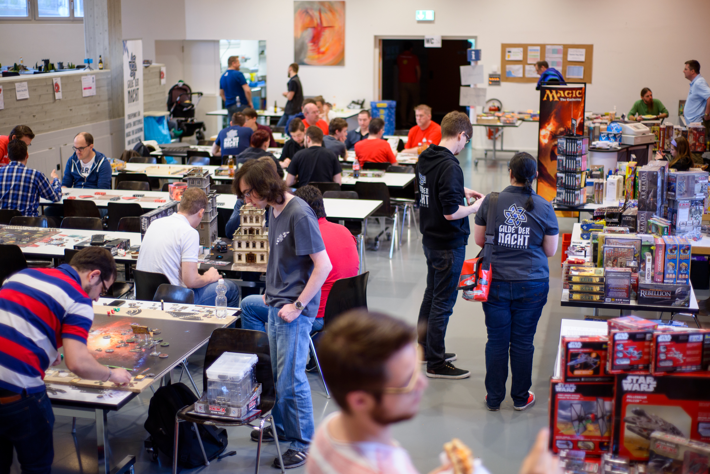

import { Box } from "@common/components/Box.tsx";
import { BoxGrid } from "@common/components/BoxGrid.tsx";
import { ButtonLink } from "@common/components/ButtonLink.tsx";
import { ImageText, ImageTextLeft, ImageTextRight } from "@common/components/ImageText.tsx";

# Neuerungen

Du kennst die Spieltage schon in und Auswendig? Dieses Jahr ist das Konzept wieder ziemlich ähnlich.

Hier folgt eine Übersicht über die neuen Programmpunkte:

## Organisierte Spiele

_Samstag + Sonntag_

<ImageText>

<ImageTextLeft>

</ImageTextLeft>

<ImageTextRight>

In separaten Räumlichkeiten werden diverse Spiele veranstaltet, die für Action und Spannung stehen. Laute, tumultreiche oder aktive Spiele oder Spiele mit hoher Spieleranzahl finden dort ihren Platz.

Du kannst dir hierzu bereits im Vorfeld einen Platz sichern:

<ButtonLink link="/anmeldung" label="Zur Anmeldung" />

 
 

Das ist auch eine gute Gelegenheit, andere Mitspieler:innen zu finden, wenn du alleine gekommen bist.

</ImageTextRight>

</ImageText>

<Box type="success" link="/programm" linkLabel="Alle Programmpunkte">
  Vermisst du etwas? Schau doch in unsere Gesamtübersicht rein.
</Box>
