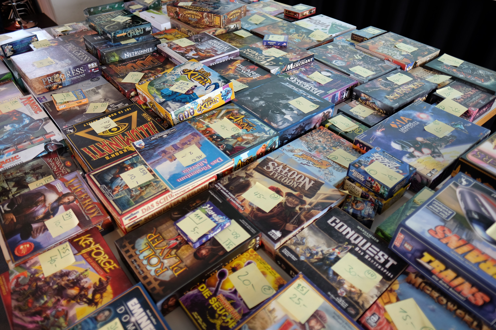
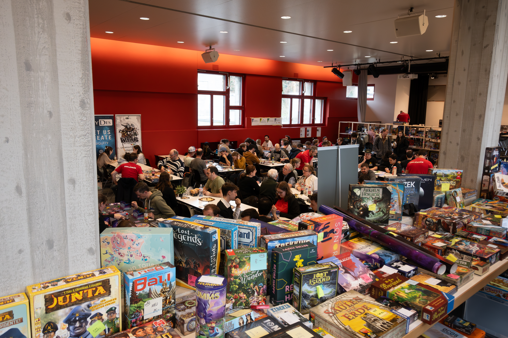

import { Box } from "@common/components/Box.tsx";
import { BoxGrid } from "@common/components/BoxGrid.tsx";
import { ButtonLink } from "@common/components/ButtonLink.tsx";
import { ImageText, ImageTextLeft, ImageTextRight } from "@common/components/ImageText.tsx";
import Outdated from "@common/components/Outdated.astro";

# Neuerungen

<Outdated event="LST" language="DE" />

Du kennst die Spieltage schon in und Auswendig? Dieses Jahr ist das Konzept wieder ziemlich ähnlich.

Hier folgt eine Übersicht über die neuen Programmpunkte:

## Flohmarkt

_Samstag + Sonntag_

<ImageText>

<ImageTextLeft>

</ImageTextLeft>

<ImageTextRight>

Wenn du schon einmal an den Spieltagen dabei warst, kennst du unseren epischen Flohmarkt bereits. Seit letztem Jahr verwenden wir eine Voranmeldung für Personen, die mehr als fünf Spiele bringen. Ist das bei dir der Fall, dann rag dich doch bitte in diese Liste ein:

<ButtonLink link="https://w0hbjqpl.forms.app/luzerner-spieltage-2025-flohmarkt-spiele-vorbereiten" label="Flohmarkt Voranmeldung" />

_10% des Flohmarkt-Umsatzes gehen in die Vereinskasse der Organisatoren ([Gilde der Nacht](https://gildedernacht.ch/)) (Verkäufe von Vereinsmitglieder ausgenommen)._

</ImageTextRight>

</ImageText>

## KLASK-Turnier
_Samstag 14:00 Uhr | Sonntag 14:00 Uhr_

<ImageText>

<ImageTextLeft>

Organisiert vom Gameorama, dem interaktiven Spielmuseum in Luzern.

<ButtonLink link="https://www.gameorama.ch/" label="Gameorama" />

</ImageTextLeft>

<ImageTextRight>

Bereits zum vierten Mal findet eines der Qualifikationsturniere für die KLASK-Schweizermeisterschaft an den Luzerner Spieltagen statt. **Aufgrund der grossen Beliebtheit dieses Jahr gleich zweimal und man kann sich über die Anmeldung schon im Vorraus einen Platz sichern!**

Mitmachen ist gratis und die besten können sich sogar für die KLASK-Schweizermeisterschaft qualifizieren.

Eine Anmeldung ist empfohlen - pro Tag gibt es 20 Plätze:

<ButtonLink link="/anmeldung" label="Zur Anmeldung" />

</ImageTextRight>

</ImageText>

## Organisierte Spiele

_Samstag + Sonntag spezifische Zeiten_

<ImageText>

<ImageTextLeft>

</ImageTextLeft>

<ImageTextRight>

An beiden Tagen werden auch Spiele veranstaltet, die für Action und Spannung stehen. Komplexe, tumultreiche oder Spiele mit hoher Spieleranzahl finden so ihren Platz.

* Twilight Imperium, Samstag 10:00  | 8 Plätze
* Monster Hunter, Samstag 16:00 | 2x 4 Plätze
* Blood on the Clock Tower, Samstag 20:00 | 14 Plätze
* Challengers!, Sonntag 10:30 | 2x 8 Plätze

Aufgrund der limitierten Platzzahl ist eine Voranmeldung empfohlen:

<ButtonLink link="/anmeldung" label="Zur Anmeldung" />

</ImageTextRight>

</ImageText>

<Box type="success" link="/programm" linkLabel="Alle Programmpunkte">
  Willst du den kompletten Überblick? Schau doch in unsere Gesamtübersicht rein.
</Box>
