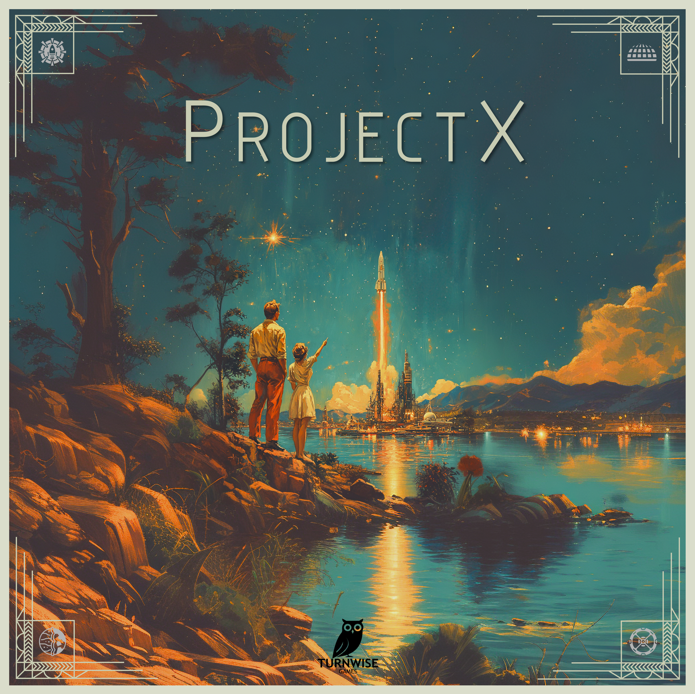
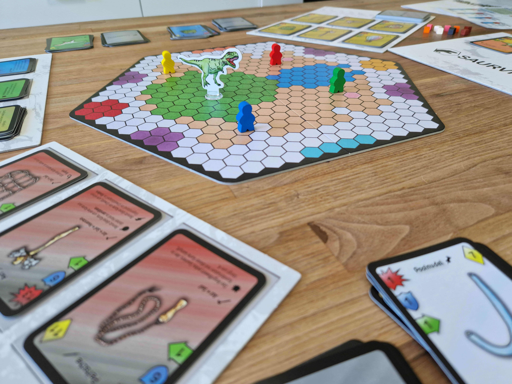
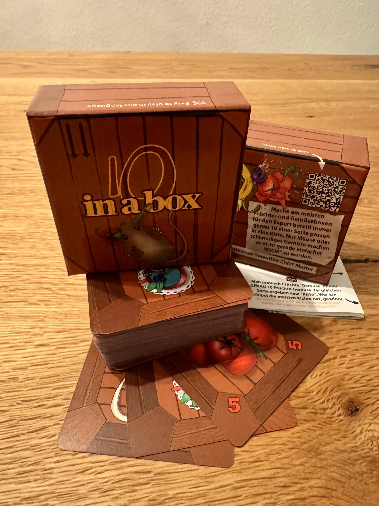

import { Box } from "@common/components/Box.tsx";
import { BoxGrid } from "@common/components/BoxGrid.tsx";
import { ButtonLink } from "@common/components/ButtonLink.tsx";
import { ImageText, ImageTextLeft, ImageTextRight } from "@common/components/ImageText.tsx";
import ReferenceGilde from "@common/components/ReferenceGilde.astro";

# Spieldesigner:innen

Die Luzerner Spieltage bieten jedes Jahr Schweizer Spieldesigner:innen eine Plattform ihre Spiele und Prototypen zu zeigen. Auf dedizierten Eventtischen erklären die Designer:innen ihre Spiele, welche danach direkt vor Ort getestet werden können.

## Rahmenbedingungen für Spieldesigner:innen

- Kostenlose Plattform für Spieldesigner:innen
- Prototypen / Spiele sollen spielbar sein
- Kein Verkaufsstand (Verkauf per Flohmarkt nach Absprache möglich)
- Garantierter Platz während den eingeplanten Eventtisch-Zeitslots
- Ausserhalb der eingeplanten Zeitslots gilt: 
    - Falls freie Spieltische und interessierte Spielende vorhanden sind, dürfen die Spiele/Prototypen natürlich auf den normalen Spieltischen gespielt werden
    - Normale Spieltische freigeben wenn nicht gespielt wird

## Spieldesigner «Project X»

_Samstag, 10 bis 18 Uhr | [Unterkirche](/adresse#raumaufteilung)_ & _Sonntag, 10 bis 14 Uhr | [Unterkirche](/adresse#raumaufteilung)_

<ImageText>

<ImageTextLeft>

</ImageTextLeft>

<ImageTextRight>

Mitte des 20. Jahrhunderts blickt die Menschheit erstmals tief in den Kosmos und sogleich direkt in ihr eigenes Ende.  Ein gewaltiger Asteroid rast auf die Erde zu und die Zeit läuft unerbittlich ab. Nur visionäre Technologien und gigantische Rettungsprojekte bieten noch Hoffnung für die Menschheit.

In diesem strategischen Sci-Fi-Spiel übernimmst du die Rolle eines von vier Projektleitern, die jeweils einen eigenen Plan zur Rettung der Erde verfolgen. Auf einem gemeinsamen Markt sicherst du dir entscheidende Technologien, entwickelst sie weiter und bringst sie Schritt für Schritt bis zur Abschussrampe, um sie dauerhaft in dein Projekt zu integrieren. Doch Ressourcen sind knapp, Konkurrenz und Intrigen allgegenwärtig: Sabotage, Diebstahl oder korrupte Mitarbeiter können deine Pläne jederzeit gefährden.

Stelle ein starkes Team aus Spezialisten zusammen, nutze Projektassistenten und schicke Agenten auf entscheidende Missionen, um dir taktische Vorteile zu sichern. Nur wer klug plant, flexibel reagiert und seine Rivalen übertrifft, kann sein Rettungsprojekt rechtzeitig vollenden und die Zukunft der Menschheit sichern

Kennerspiel\
2-4 Spieler\
ab 12 Jahren\
ca. 45 Minuten pro Spieler

<ButtonLink link="https://www.turnwise.ch" label="Turnwise Games" />

</ImageTextRight>

</ImageText>

## Spieldesigner «Saurvival»

_Sonntag, 10 bis 17 Uhr | [Unterkirche](/adresse#raumaufteilung)_

<ImageText>

<ImageTextLeft>

</ImageTextLeft>

<ImageTextRight>

Begib dich auf ein Abenteuer und kämpf in einer Gegend voller wilder Saurier um das Überleben. Ein paar einfache Gegenstände bekommst du mit auf den Weg, den Rest musst du selber suchen, erkämpfen oder herstellen. Nutz die Stärke und die Fähigkeiten der Saurier, indem du sie mit einem Fangutensil deiner Truppe hinzufügst. Sammle auf der Ebene, in der Höhle und auf dem See alles, was du brauchst, um dich im Urwald der ultimativen Herausforderung zu stellen: dem T-Rex!

Das Spiel "Saurvival" ist im Jahr 2022 mit Hilfe eines Crowdfundings für den Schweizer Markt erschienen. Jessica und Marc (das Entwicklerteam) sind vor Ort, um euch das Spiel zu zeigen und eine Runde mit euch zu spielen.

</ImageTextRight>

</ImageText>

## Spieldesigner Thomas Vogel

_Sonntag, 14 bis 17 Uhr | [Unterkirche](/adresse#raumaufteilung)_

<ImageText>

<ImageTextLeft>

</ImageTextLeft>

<ImageTextRight>

Was macht man als Vater und Lehrer eigentlich, wenn man eine Leidenschaft für Gesellschaftsspiele hat, gerne malt und gerne ein Projekt am laufen hat? Man entwickelt Kartenspiele. Ich Thomas Vogel freue mich euch an der Messe kennenzulernen und ein paar meiner Spiele zu spielen.

</ImageTextRight>

</ImageText>

<ReferenceGilde event="LST" />

