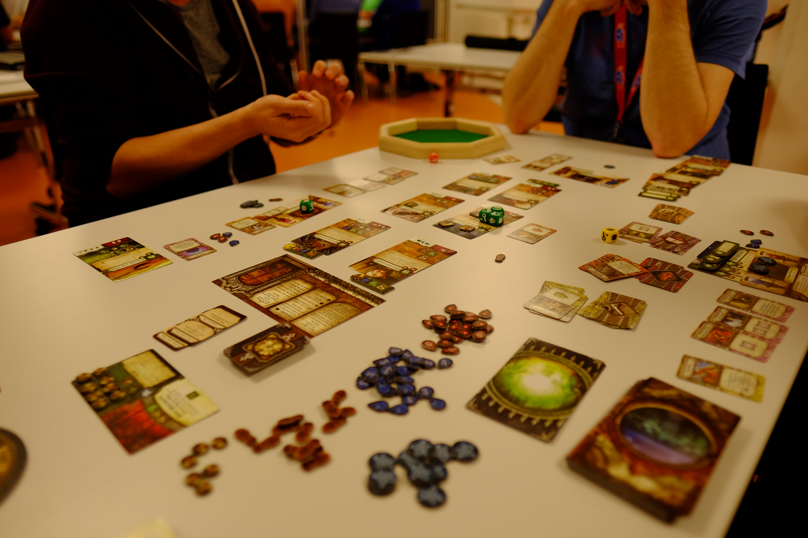
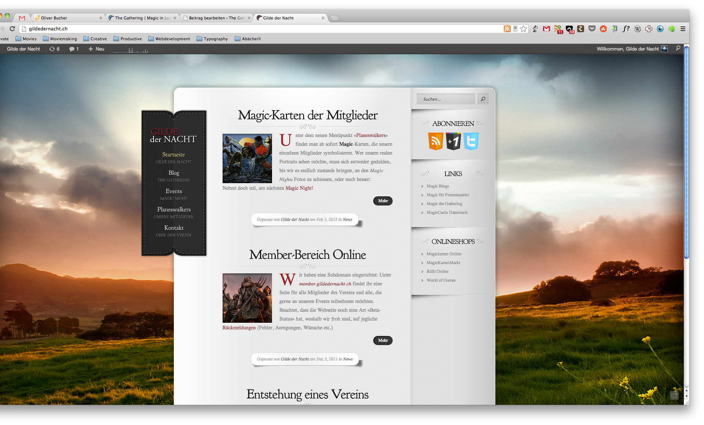

# Verein

Die **Gilde der Nacht** fördert das Spielhobby in und um Luzern. Wir organisieren das ganze Jahr jede Menge Events, an denen du neue Freundschaften schliesst und viele tolle Spiele kennenlernst. Komm doch vorbei und sag Hallo!



## Geschichte

Der erste Gilde der Nacht Verein wurde im **Spätherbst 2011** von 4 passionierten _Magic the Gathering_-Spielern gegründet und unsere Events entwickelten sich rasch zu einem beliebten Treffpunkt für Spieler aus der Region.

3 Jahre später wurde uns klar, das Magic nicht alles ist (versteht uns nicht falsch, Magic ist ein fantastisches Spiel — aber manchmal haben wir das Bedürfnis uns gegenseitig mit Plastikminiaturen das Leben zur Hölle zu machen oder dank einem genialen Partyspiel, vor Lachen in die Hosen zu machen). So entstand der Spielverein Element 15.

Als auch dieser rasch an Popularität zunahm, beschlossen wir an der Fusions-Generalversammlung vom 9. Mai 2015 diese beiden Vereine zusammenzulegen und setzten uns zum Ziel, alle glücklich zu machen; Ob Magic-, Strategie-, Party-, Rollen- oder Tabletop-Spieler:innen.




