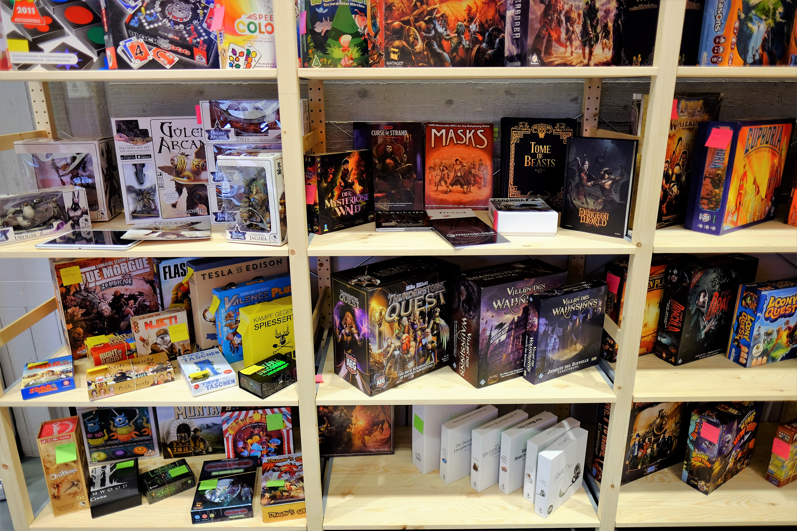
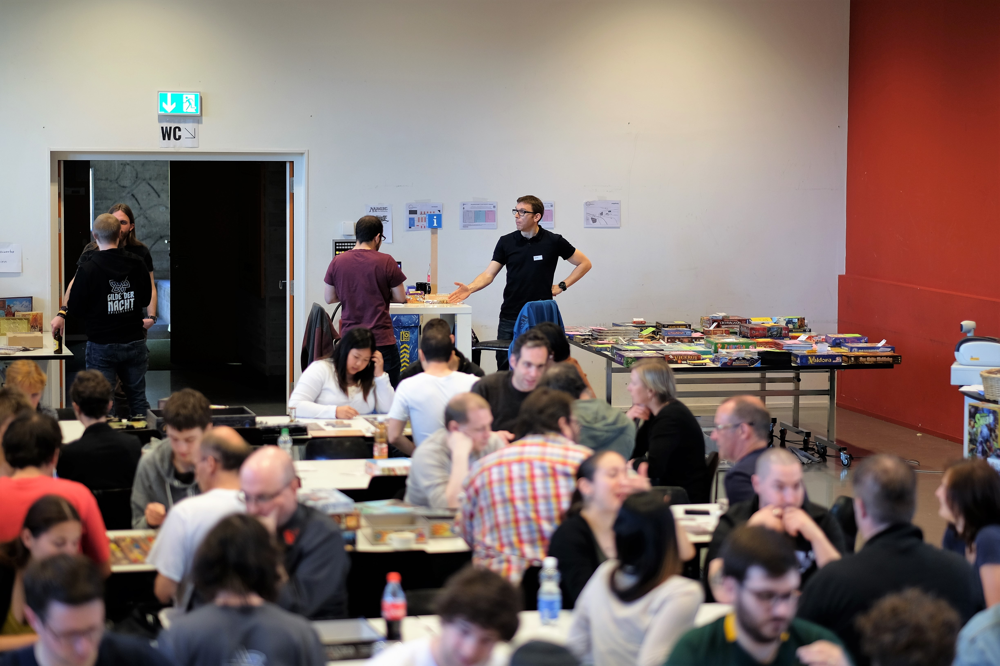


Looking for a short and sweet overview in English?


# Herzlich willkommen


**Wir sehen uns nächstes Jahr am 11. + 12. März 2023.**


Am **Samstag, 12. März 2022** (9.00 bis 0.30 Uhr) verwandeln wir den [Pfarreisaal St. Johannes im Würzenbach-Quartier](https://www.google.com/maps/place/Katholische+Pfarrei+St.+Johannes+Luzern+-+W%C3%BCrzenbach/@47.0557335,8.3467125,18z/data=!4m5!3m4!1s0x478ffbe4a1717e11:0x63ba1cf90c4e4c46!8m2!3d47.055803!4d8.3448403) in eine Oase für Spielerinnen und Spieler. Ob jung oder alt, ob Stratege oder Teamplayer, ob Bastler oder Geniesser, wir haben für jeden was auf dem Speiseplan. Apropos Speiseplan: für dein kulinarisches Wohl ist auch gesorgt.

Falls du Fragen hast oder an den Spieltagen [**mithelfen**](/helfen) möchtest, zögere nicht, uns über das [Kontaktformular](/kontakt) anzuschreiben. Wir freuen uns auf deine Nachricht.





## Spieltage «Light»

Nach zwei Jahren Pandemie-bedingter Pause, starten wir im 2022 etwas reduziert:


**DIE SPIELTAGE 2022 FINDEN NUR AM SAMSTAG STATT!**\
Falls dir ein Tag zu wenig ist, schau doch im Kalender des Spielvereins **Gilde der Nacht** vorbei. Bereits am Tag nach den Luzerner Spieltagen findet ein Spieltreffen statt.


### Programm

Komm vorbei und lass dir eines der **unzähligen Brettspiele** von unseren Erklärbären erklären.

Hast du noch nie ein **Rollenspiel** oder ein **Tabletop/Miniaturspiel** ausprobiert? Bei uns erhältst du die Gelegenheit reinzuschnuppern.

Auf unserem **Flohmarkt** findest du sicher ein tolles Spiel für deine Sammlung. Oder bringe deine Spiele mit, die ein neues Zuhause suchen.

Genaueres findest du auf unserer [Programm-Seite](/programm).

### Die wichtigsten Informationen auf einen Blick

#### Öffnungszeiten

Samstag, 12. März 2022, 9.00 bis 0.30 Uhr.

#### Eintritt & Anmeldung

Der Eintritt ist kostenfrei und eine Anmeldung ist nicht nötig.

#### Anreise

Die Adresse lautet: [Pfarrei St. Johannes, Schädrütistrasse 26, 6006 Luzern](https://www.google.com/maps/place/Katholische+Pfarrei+St.+Johannes+Luzern+-+W%C3%BCrzenbach/@47.0557335,8.3467125,18z/data=!4m5!3m4!1s0x478ffbe4a1717e11:0x63ba1cf90c4e4c46!8m2!3d47.055803!4d8.3448403)

Vom Bahnhof Luzern sind die Räumlichkeiten bequem in 15 Minuten erreichbar per **Bus 8** (Aussteigen an der _Würzenbachmatte_ Haltestelle) oder **Bus 14** (Aussteigen an der _Schlösslirain_ Haltestelle).

Eine (kostenpflichtige) Parkgarage befindet sich 5 Gehminuten entfernt. Gehört zur Migros an der Adresse [Würzenbachstrasse 19, Luzern](https://www.google.com/maps/place/Migros+Supermarkt/@47.0548083,8.3433408,18.5z/data=!4m5!3m4!1s0x478ffb4e3b438fcf:0x44bae0889972cca5!8m2!3d47.0550141!4d8.3437071).

#### Verpflegung

Ein Kiosk steht während den Öffnungszeiten zur Verfügung und **am Mittag und am Abend kochen** wir etwas Leckeres für euch.
