# 3D Modellierung

[[toc]]

## Grundlagen

Hinweis: Dieses Dokument ist die Grundlage für ein Workshop. Viele Begriffe werden hier bewusst nicht erklärt, sondern sind lediglich eine Diskussionsgrundlage und lassen sich einfacher zeigen als erklären.

### Software für Künstler:innen

Der Fokus liegt darauf mit einer grossen Anzahl an verschiedenen Werkzeugen möglichst effizient unterschiedlichste Modelle erstellen zu können. Die Ästhetik steht im Vordergrund.

- [Blender](https://www.blender.org/): Modellierung, Animationen, Texturen, Simulation, Visualisierung, VFX, ... ***OpenSource***
- [SketchUp](https://www.sketchup.com/products/sketchup-for-web): Modellierung für Anfänger

### Software Ingenieur:innen

Der Fokus ist oft dass man das Resultat irgendwie produziert (Fräsen, 3D Drucken, ...). In der Produktion sind unter anderem Reproduzierbarkeit, Massangaben und Toleranzen wichtig.

- [BlocksCAD](https://www.blockscad3d.com/): Grafische Oberfläche für OpenSCAD
- [FreeCAD](https://www.freecadweb.org/): CAD Programm ***OpenSource***
- [Fusion 360](https://www.autodesk.com/products/fusion-360/personal): Professionelles CAD Programm (zwingende Anmeldung)
- [LeoCAD](https://www.leocad.org/): Modelle mit Klemm-Bausteinen aufbauen ***OpenSource***
- [OpenJSCAD](https://openjscad.com/): Online Variante von OpenSCAD ***OpenSource***
- [OpenSCAD](https://openscad.org/): Modelle mit Text aufbauen ***OpenSource***
- [TinkerCAD](https://www.tinkercad.com/): Eingeschränktes aber einfaches CAD Programm

### Schwierigkeitsgrade

Objekte die nahezu nur aus Ecken und Kanten bestehen, oder solche die gleichmässig abgerundet sind, sind tendenziell einfacher zu modellieren. Je mehr Details ein Objekt hat desto aufwändiger wird das modellieren.

Obwohl Menschen verhältnismässig gleichmässig wären, fallen uns oft kleine Unregelmässigkeiten in Proportionen auf (siehe auch [Uncanny Valley](https://de.wikipedia.org/wiki/Uncanny_Valley)). Eine zusätzliche Schwierigkeit sind Kleider, die Haare und das texturieren des Gesichtes.

- Einfach: Gebäude, Möbel, Geschirr, Werkzeuge
- Mittel: Bäume, Kleider, Fahrzeuge
- Schwer: Tiere, Menschen

## Blender

https://www.blender.org/

Blender ist in den letzten Jahren zu einer der bekannteren Modellierungs-Software geworden. Blender wird seid 20 Jahren aktiv entwickelt, ständig erweitert und oft auch vereinfacht. Inzwischen gibt es auch viele kostenlose Plugins.

### Vorbereitung

Was benötigt man

- Die Software "Blender". Herunterladen und installieren: https://www.blender.org/download/
- Ein Laptop mit 3D Unterstützung (am besten Blender starten, wenn nach ein paar Sekunden der Bildschirm wie unten aussieht, stehen die Sterne schon mal günstig)
- Eine Maus, idealerweise eine mit Scroll-Rad und einer mittleren Maustaste, was oftmals das Scroll-Rad, das man auch drücken kann, selber ist (erleichtert die Bedienung, geht aber auch ohne)
- Idealerweise eine Tastatur mit einem Ziffernblock (erleichtert ebenfalls die Bedienung, geht aber auch ohne)

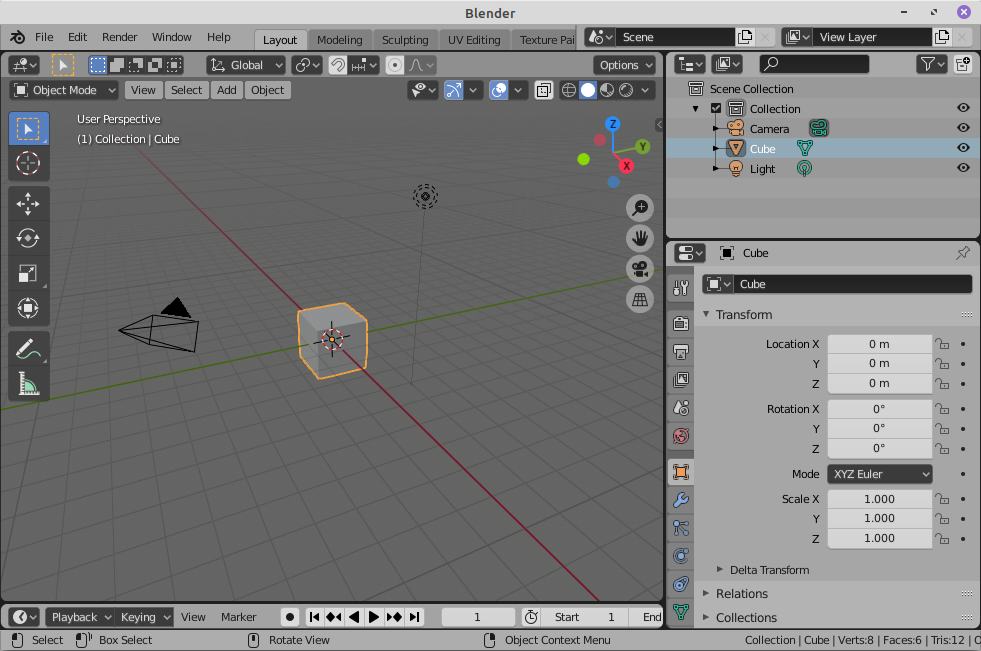

### Shortcuts

| Taste | Aktion |
| - | - |
| Numpad 3 | View From X / Right |
| Numpad 1 | View From Y / Front |
| Numpad 7 | View From Z / Top |
| Mittlere Maustaste | View Rotate |
| Shift + Mittlere Maustaste | View Move |
| Numpad . | View Focus |
| Tab | Object/Edit Mode |
| G | Move |
| S | Scale |
| R | Rotate |
| E | Extrude |
| 1 | Vertex Select Mode |
| 2 | Edge Select Mode |
| 3 | Face Select Mode |
| Alt + Z | X-Ray Mode |
| F3 | Search |

### Funktionen

- Modeling
- Sculpting
- Texturing
- Shading
- Animation
- Rigging
- Simulation
- Rendering
- Game Engine
- Scripting
- Video Editing
- VFX
- Audio

### Begriffe

Allgemein: Vertex, Edge, Face, Normal, UV, Mesh, Rigid Body, Soft Body, Z-Buffer, Forward Kinematic (FK), Inverse Kinematic (IK), Shader, Bones, Rigging, Skinning, Shadow Mapping, Bidirectional Scattering Distribution Function (BSDF), Subsurface Scattering (SSS), Screen Space Ambient Occlusion (SSAO)

Blender: Eevee, Cycles

### Problemstellen

- Object Scaling = 1.0
- Lock Object Modes
- Speicherort Texturen
- Grouping/Collections

### Videos

- Doughnut Tutorial: https://www.youtube.com/playlist?list=PLjEaoINr3zgEq0u2MzVgAaHEBt--xLB6U
- Blender 2.8 Fundamentals: https://www.youtube.com/playlist?list=PLa1F2ddGya_-UvuAqHAksYnB0qL9yWDO6

### Beispiele

#### Airplane
Mirror Modifier & Subdivision Modifier
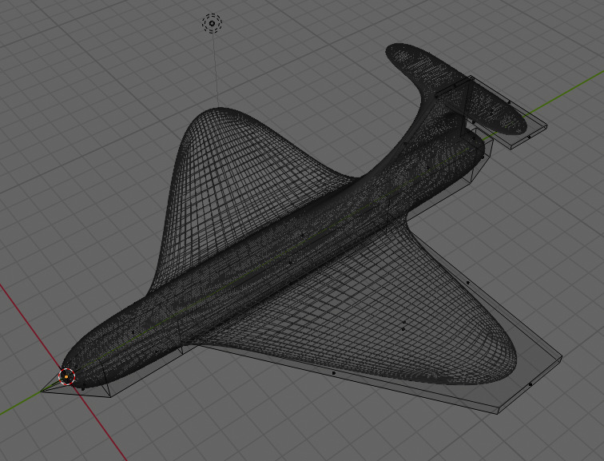
[Airplane](airplane.blend)

#### Rope
Array Modifier & Screw Modifier & Curve Modifier
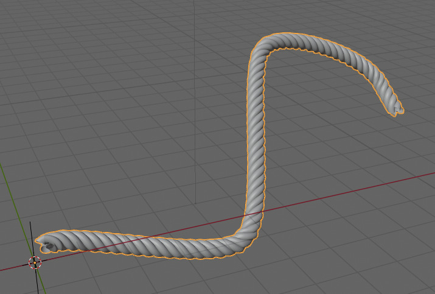
[Rope](rope.blend)

#### Cloth
Cloth Simulation & Collision Simulation & Vertex Group
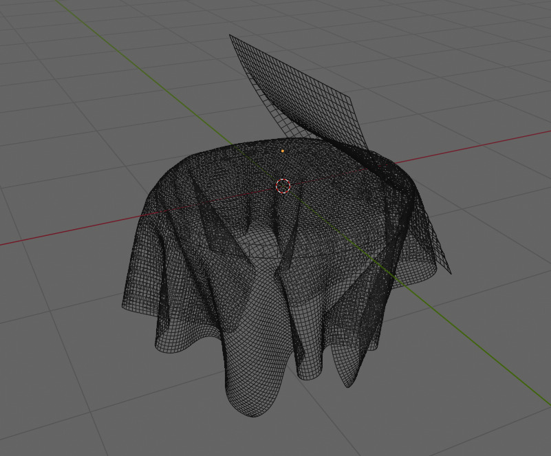
[Cloth](cloth.blend)

#### Terrain
Displace Modifier & ColorRamp Material
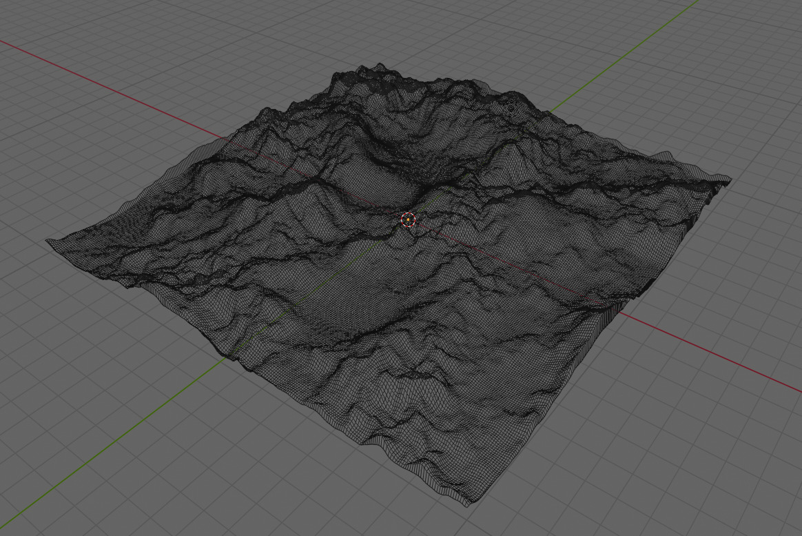
[Terrain](terrain.blend) & [Terrain Heightmap](wikipedia-heightmap.png)

#### Comic
Z-Fighting & Smooth/Flat Shading & ColorRamp Material
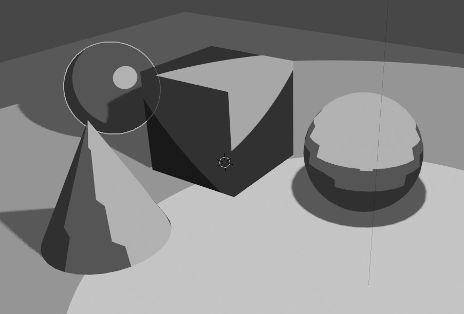
[Comic](comic.blend)

#### Robot
Texture & Parenting & Animation
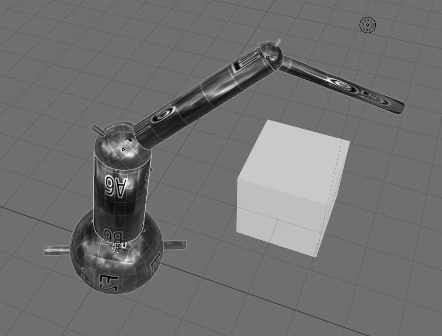
[Robot](robot.blend) & [Robot Texture](robot.png)

#### Water
Fluid Simulation & Glass Material
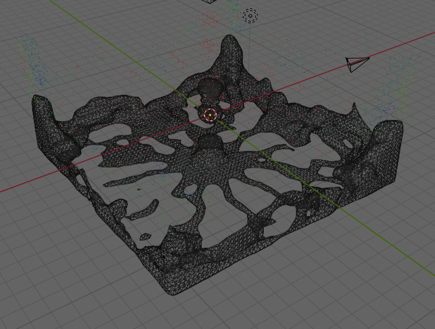
[Water](water.blend)

#### Body
Bones & Skin Modifier
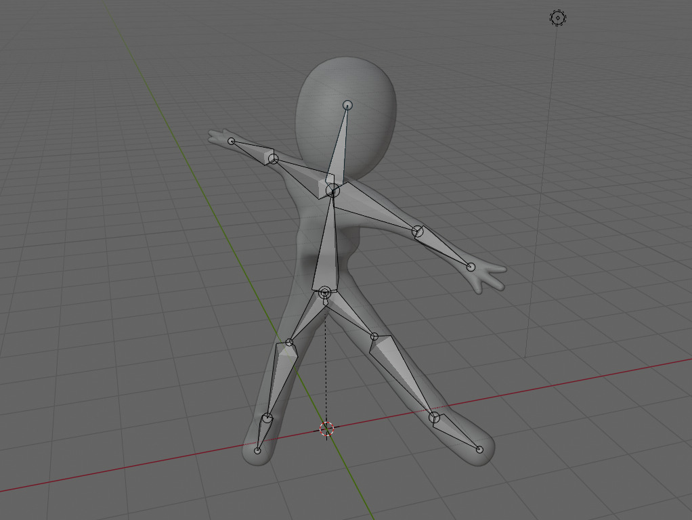
[Body](body.blend)

#### Cloud
Volumetrics & Voronoi Texture
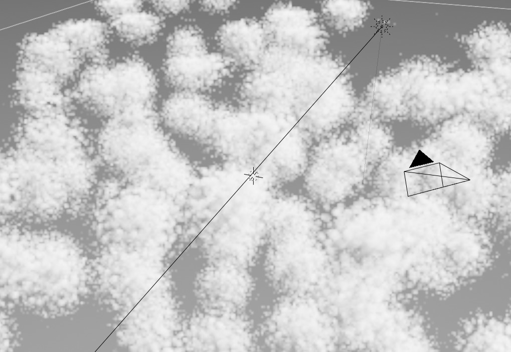
[Cloud](cloud.blend)

#### VFX
Tracker & Solve Camera Motion
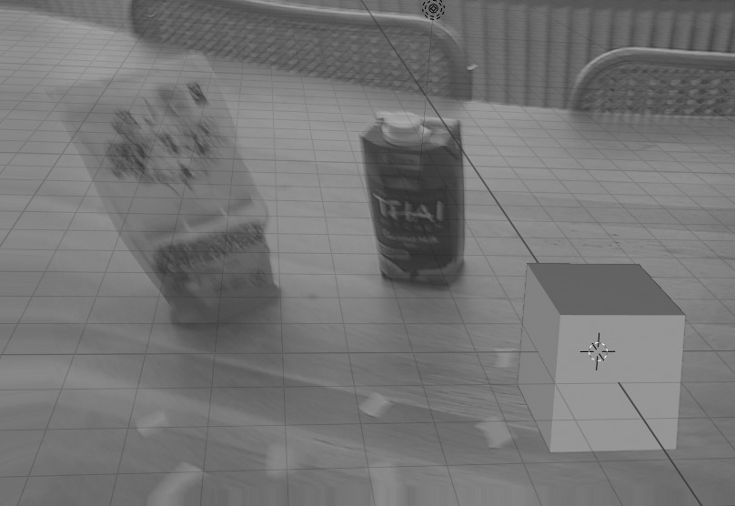
[VFX](vfx.blend) & [VFX Video](vfx.mp4)
