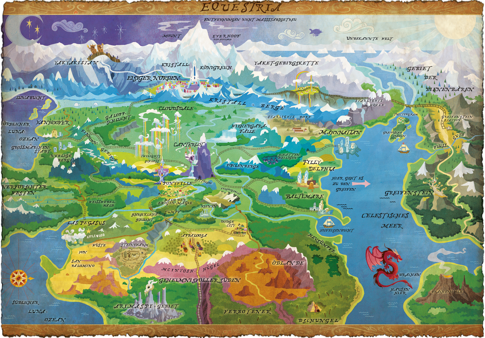

# Familientisch

Der Familientisch ist ein Tisch am dem Rollenspiele die für Kinder, Jugendliche und Familien geeignet sind, vorgestellt und ausprobiert werden können. Die Bedingung die wir uns dazu selber auferlegt haben sind:

- Kosten: weniger als 100 CHF
- Spielzeit: Idealerweise weniger als 60 Minuten, maximal 2 Stunden am Stück
- Inhalt: keine oder nur ein Minimum an Gewalt, kein Fachwissen notwendig
- Altersgruppe: Nichts wo man älter als 16 Jahre sein sollte
- Sprache: Muss in Deutsch erhätlich sein

## My Little Pony - Tails of Equestria

- Kosten: 25€
- Altergruppe: 6+
- Spielzeit: ca. 1 Stunde
- Sprache: Deutsch
- Anzahl Spieler:innen: ???

https://www.f-shop.de/my-little-pony-tails-of-equestria/

https://www.lord-selis.de/downloads/my-little-pony-tails-of-equestria/

https://mlp.fandom.com/de/wiki/Equestria

[My Little Pony - Unerwarteter Besuch](My-Little-Pony-Unterwarteter-Besuch.pdf)

https://ulisses-spiele.de/assets/document/F6/ToE_Vorbesteller-Szenario_Unerwarteter-Besuch_8165.pdf?x54976

TODO

- Charakter Bögen

## Es war einmal ...

Jede Person bekommt ein paar Karten. Auf den Karten sind Gegenstände, Gebäude, Märchenfiguren, aber auch Adjektive abgebildet oder aufgeschrieben. Mithilfe dieser Karten muss man eine Geschichte miteinander erzählen. Es gibt ein paar wenige Regeln, die erklären wann welche Person an der Reihe ist.

Eignet sich gut um herauszufinden ob es einem überhaupt Spass macht kreativ beim erzählen zu sein und ohne lang zu überlegen Geschichten zu erfinden. Da man miteinander eine Geschichte erfindet, müssen sich die Anwesenden gegenseitig zuhören.

- Kosten: 17 CHF
- Altergruppe: 8+
- Spielzeit: < 15 Minuten
- Sprache: Deutsch
- Anzahl Spieler:innen: 2 - 6

https://pegasus.de/es-war-einmal

https://www.wog.ch/index.cfm/details/product/60626%2DEs%2Dwar%2Deinmal

## Fabula Rasa

Das Spiel beinhaltet nichts anderes als eine Reihe von Karten mit Symbolen. Mithilfe diesen Symbolen erfindet man einen möglichen Tathergang.

Da sich alle Mitspielenden diesen Tathergang zu einem gewissen Grad im Kopf behalten müssen, erfordert das Spiel einiges an Aufmerksamkeit, aber auch Fantasy weil man den Tathergang ständig ein wenig anpasst.

- Kosten: 18 CHF
- Altergruppe: 8+
- Spielzeit: 20 Minuten
- Sprache: Deutsch
- Anzahl Spieler:innen: 2-5

https://www.exlibris.ch/de/hobby-spiele-brettspiele/fabula-rasa-crime/id/4260071881335/

## Untold

Man erfindet miteinander eine eigene Fernseh-Serie und spielt darin eine Episode. Würfel (Story-Cubes) und einige Karten geben einem ein paar Vorgaben, aber insgesamt ist man sehr frei.

Es ist schon einiges kreativität erforderlich um ein amüsante Episode zu erfinden. Was an dem Spiel Untold gut umgesetzt wurde, dass es viele Elemente, die in klassischen Rollenspiel Vorkommen, beinhaltet und auf das wichtigste reduziert hat. Es eignet sich gut als Einstieg in das Rollenspiel.

- Kosten: 45 CHF
- Altergruppe: 12+
- Spielzeit: 2 Stunden
- Sprache: Deutsch
- Anzahl Spieler:innen: 2 - 4

https://www.wog.ch/index.cfm/details/product/65597%2DUntold%2DDas%2DAbenteuer%2Dwartet

## Alle sind John

- Kosten: Kostenlos
- Altergruppe: 12+
- Spielzeit: 30 Minuten
- Sprache: Deutsch
- Anzahl Spieler:innen: ???

https://www.stefan-graf.com/wp-content/files/everyone_is_john.jpg

https://rpggeek.com/rpgitem/123829/everyone-john

## Link zu dieser Seite

