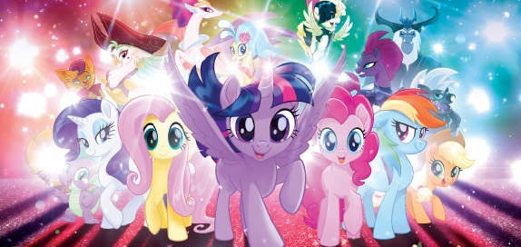

# Familientisch

Der Familientisch ist ein Tisch am dem Rollenspiele die für Kinder, Jugendliche und Familien geeignet sind, vorgestellt und ausprobiert werden können. Die Bedingungen die wir uns dazu selber auferlegt haben sind:

- Kosten: Weniger als 60 CHF
- Spielzeit: Idealerweise weniger als 60 Minuten, maximal 2 Stunden am Stück
- Inhalt: Waffen oder Gewalt sind unwichtig oder kommen gar nicht vor, kein Fachwissen notwendig
- Altersgruppe: Nichts wo man älter als 16 Jahre sein sollte
- Sprache: Muss in Deutsch erhätlich sein

## My Little Pony - Tails of Equestria

My Little Pony ist ein typisches Rollenspiel mit dem vielleicht grössten Unterschied dass die Mitspielenden jeweils ein Pony spielen. Als typisches Rollenspiele hat es eine Charakter- bzw. Pony-Erschaffung, und auch diverse Regeln, die aber zum Glück eher einfach gehalten sind.

Was an dem Spiel positiv auffällt, im Gegensatz zu anderen Rollenspiele die eigentlich auch für Kinder gedacht wären, das Waffen und Gewalt in diesem Spiel nicht im Fokus sind. Alle Abenteuer die wir gefunden haben, erfordern ein ständiges Miteinander und gehen vor allem darum dass man Einander und Anderen hilft.

- Kosten: 25€
- Altergruppe: 6+
- Spielzeit: ca. 1 Stunde
- Sprache: Deutsch
- Anzahl Spieler:innen: ???
- Spielleitung Notwendig: Ja

Spielmaterial

- [My Little Pony - Karte](My-Little-Pony-Weltkarte.jpg)
- [My Little Pony - Abenteuer - Unerwarteter Besuch](My-Little-Pony-Unterwarteter-Besuch.pdf)
- [My Little Pony - Abenteuer - See](My-Little-Pony-See.png)
- [My Little Pony - Einhorn](Einhorn_A6.pdf)
- [My Little Pony - Erdpony](Erdpony_A6.pdf)
- [My Little Pony - Pagasus](Pegasus_A6.pdf)

Weiterführende Links:

- https://www.f-shop.de/my-little-pony-tails-of-equestria/
- https://www.lord-selis.de/downloads/my-little-pony-tails-of-equestria/
- https://ulisses-spiele.de/assets/document/F6/ToE_Vorbesteller-Szenario_Unerwarteter-Besuch_8165.pdf?x54976
- https://mlp.fandom.com/de/wiki/Equestria
- https://www.patreon.com/GoAdventureMaps

## Es war einmal ...

Jede Person bekommt ein zufällig einige Karten. Auf den Karten sind Gegenstände, Gebäude, Märchenfiguren, aber auch Adjektive abgebildet oder aufgeschrieben. Mithilfe dieser Karten muss man eine Geschichte miteinander erzählen. Es gibt ein paar wenige Regeln, die erklären wann welche Person an der Reihe ist.

Eignet sich gut um herauszufinden ob es einem überhaupt Spass macht kreativ beim Erzählen zu sein. Da man Miteinander eine Geschichte erfindet, müssen sich die Anwesenden gegenseitig Aufmerksamkeit schenken.

- Kosten: 17 CHF
- Altergruppe: 8+
- Spielzeit: < 15 Minuten
- Sprache: Deutsch
- Anzahl Spieler:innen: 2 - 6
- Spielleitung Notwendig: Nein

Weiterführende Links:

- https://pegasus.de/es-war-einmal
- https://www.wog.ch/index.cfm/details/product/60626%2DEs%2Dwar%2Deinmal

## Fabula Rasa

Das Spiel beinhaltet nichts anderes als eine Reihe von Karten mit Symbolen. Mithilfe diesen Symbolen erfindet man einen möglichen Tathergang.

Da sich alle Mitspielenden diesen Tathergang zu einem gewissen Grad im Kopf behalten müssen, erfordert das Spiel Aufmerksamkeit, aber auch Fantasie weil man den Tathergang ständig ein wenig anpasst.

- Kosten: 18 CHF
- Altergruppe: 8+
- Spielzeit: 20 Minuten
- Sprache: Deutsch
- Anzahl Spieler:innen: 2-5
- Spielleitung Notwendig: Nein

Weiterführende Links:

- https://www.exlibris.ch/de/hobby-spiele-brettspiele/fabula-rasa-crime/id/4260071881335/

## Untold

Man erfindet miteinander eine eigene Fernseh-Serie und spielt darin eine Episode. Würfel (Story-Cubes) und einige Karten geben einem ein paar Vorgaben, aber insgesamt ist man sehr frei.

Es ist Kreativität erforderlich um ein amüsante Episode zu erfinden. Was Untold gut umsetzt, dass es viele Elemente die in klassischen Rollenspiel auch vorkommen beinhaltet und auf das wichtigste reduziert. Das Spiel eignet als Einstieg in das Rollenspiel.

- Kosten: 45 CHF
- Altergruppe: 12+
- Spielzeit: 2 Stunden
- Sprache: Deutsch
- Anzahl Spieler:innen: 2-4
- Spielleitung Notwendig: Nein

Weiterführende Links:

- https://www.wog.ch/index.cfm/details/product/65597%2DUntold%2DDas%2DAbenteuer%2Dwartet

## Alle sind Jane/John

Die Hauptperson um welche sich die Geschichte dreht ist Jane oder John. Jane/John hat eine psychische Erkrankung. Unterschiedliche Stimmen übernehmen jeweils die Kontrolle über Jane/John und jeder dieser Stimmen hat unterschiedliche Fähigkeiten und Ziele. Jede mitspielende Person spielt eine Stimme im Kopf von Jane/John.

Die guten Seiten an diesem Spiel sind dass es kostenlos ist, die Regeln auf einer halben A4 Seite Platz haben, keine Vorbereitung notwendig ist und es mit etwas Fantasie zu lustigen aber auch tragischen Situationen kommen kann. 

- Kosten: Kostenlos
- Altergruppe: 14+
- Spielzeit: 30 Minuten
- Sprache: Deutsch
- Anzahl Spieler:innen: 3-6
- Spielleitung Notwendig: Ja

Weiterführende Links:

- https://www.stefan-graf.com/wp-content/files/everyone_is_john.jpg
- https://rpggeek.com/rpgitem/123829/everyone-john

## Link zu dieser Seite

[QR Code Familientisch Gross](qr-code.png)
