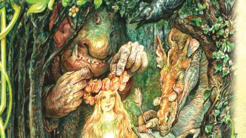
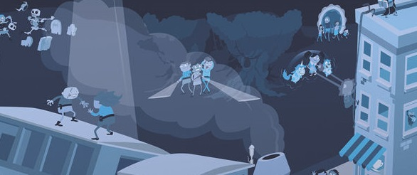
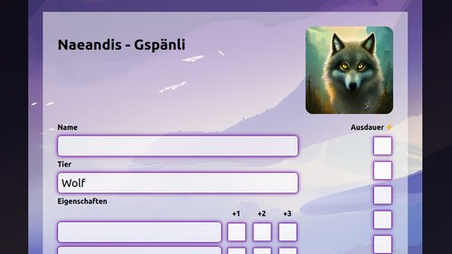

# Familientisch

Der Familientisch ist ein Tisch, an dem Rollenspiele, die für Kinder, Jugendliche und Familien geeignet sind, vorgestellt werden und ausprobiert werden können. Die Bedingungen, die wir uns dazu selber auferlegt haben, sind:

- Kosten: Weniger als 50 CHF
- Spielzeit: Idealerweise weniger als 60 Minuten
- Inhalt: Waffen oder Gewalt sind unwichtig oder kommen gar nicht vor, kein Fachwissen notwendig
- Altersgruppe: Nichts wo man älter als 16 Jahre sein sollte
- Sprache: Muss in Deutsch erhätlich sein

## Es war einmal ...

Jede Person bekommt zufällig einige Karten. Auf den Karten sind Gegenstände, Gebäude, Märchenfiguren, aber auch Adjektive abgebildet oder aufgeschrieben. Mithilfe dieser Karten erzählt die Gruppe gemeinsam eine Geschichte.

Das Spiel eignet sich gut, um herauszufinden, ob es einem Spass macht, kreativ beim Erzählen zu sein. Da man Miteinander eine Geschichte erfindet, müssen sich die Anwesenden gegenseitig Aufmerksamkeit schenken.

- Kosten: 20 CHF
- Altergruppe: 8+
- Spielzeit: < 15 Minuten
- Sprache: Deutsch
- Anzahl Spielerende: 2 - 6
- Spielleitung notwendig: Nein

Weiterführende Links:

- https://pegasus.de/es-war-einmal
- https://www.wog.ch/index.cfm/details/product/60626%2DEs%2Dwar%2Deinmal

## Fabula Rasa

Dieses Spiel beinhaltet nichts anderes, als eine Reihe von Karten mit Symbolen. Mithilfe dieser Symbole erfindet man einen möglichen Tathergang.

Da sich alle Mitspielenden diesen Tathergang zu einem gewissen Grad im Kopf behalten müssen, erfordert das Spiel Aufmerksamkeit, aber auch Fantasie, weil man den Tathergang ständig ein wenig anpasst.

- Kosten: 20 CHF
- Altergruppe: 8+
- Spielzeit: 20 Minuten
- Sprache: Deutsch
- Anzahl Spielende: 2-5
- Spielleitung notwendig: Nein

Weiterführende Links:

- https://www.exlibris.ch/de/hobby-spiele-brettspiele/fabula-rasa-crime/id/4260071881335/
- https://www.exlibris.ch/de/hobby-spiele-brettspiele/fabula-rasa-seemannsgarn/id/4260071882080/

## Untold - Das Abenteuer Wartet

Man erfindet gemeinsam eine eigene Fernsehserie und spielt darin eine Episode. Würfel (Story-Cubes) und einige Karten geben einem ein paar Vorgaben, aber insgesamt ist man sehr frei.

Es ist Kreativität erforderlich, um eine amüsante Episode zu erfinden. Untold beinhaltet viele Elemente, die in klassischen Rollenspielen auch vorkommen, jedoch auf das Minimum reduziert. Untold eignet sich daher gut als Einstieg in das Rollenspiel.

- Kosten: 50 CHF
- Altergruppe: 12+
- Spielzeit: 2 Stunden
- Sprache: Deutsch
- Anzahl Spielende: 2-4
- Spielleitung notwendig: Nein

Weiterführende Links:

- https://spielbude.ch/untold-das-abenteuer-wartet

## Alle sind Jane/John

Die Hauptperson, um die sich die Geschichte dreht, ist Jane oder John. Jane/John hat eine psychische Erkrankung. Unterschiedliche Stimmen übernehmen jeweils die Kontrolle über Jane/John und jede dieser Stimmen hat unterschiedliche Fähigkeiten und Ziele. Jede mitspielende Person spielt eine Stimme im Kopf von Jane/John.

Das Spiel ist kostenlos und die Regeln finden auf einer halben A4 Seite Platz. Es ist keine Vorbereitung nötig und mit etwas Fantasie kommt es zu lustigen, aber auch tragischen Situationen.

- Kosten: Kostenlos
- Altergruppe: 14+
- Spielzeit: 30 Minuten
- Sprache: Deutsch
- Anzahl Spielende: 3-6
- Spielleitung notwendig: Ja

Weiterführende Links:

- https://www.stefan-graf.com/wp-content/files/everyone_is_john.jpg
- https://rpggeek.com/rpgitem/123829/everyone-john

## Naeandis

- Kosten: Kostenlos
- Altergruppe: 7+
- Spielzeit: 30 - 60 Minuten
- Sprache: Deutsch
- Anzahl Spielende: 2-6
- Spielleitung notwendig: Optional

Ein typisches Rollenspiel in welchem alle Mitspielenden ein Tier spielen. Die Tiere haben alle spezielle Eigenschaften, wobei der Kreativität, Tiere mit ganz eigenen Fertigkeiten zu erschaffen, kaum Grenzen gesetzt sind. Es gibt eine Reihe von vorgefertigen Abenteuern, aber auch eine Vorlage wie man ohne Spielleitung Abenteuer miteinander erleben kann. Die Regeln sind kurz gehalten und auf der Webseite gibt es diverse Kreativitäts-Hilfsmittel (Namens-Generator, Inspirations-Karten, ...).

Weiterführende Links:

- https://naeandis.org

## Link zu dieser Seite

[QR Code Familientisch Gross](qr-code.png)
