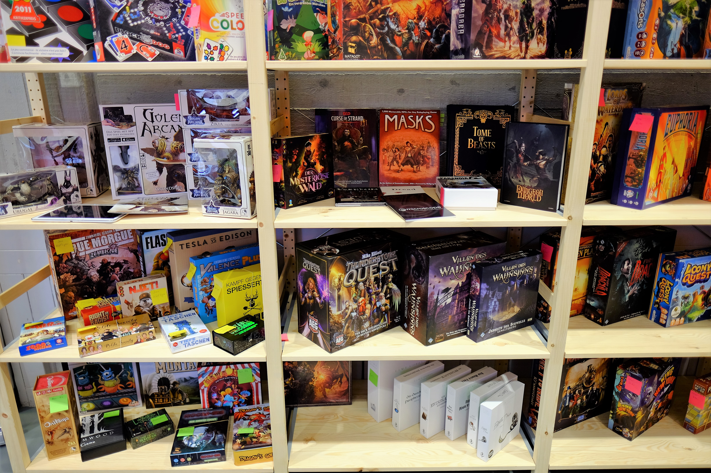
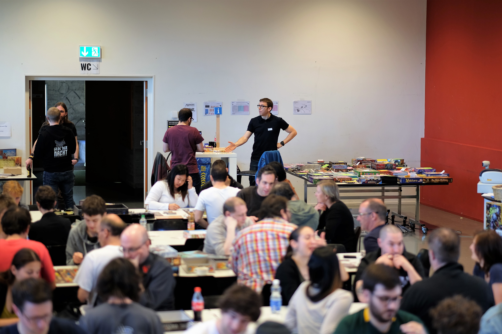


Looking for a short and sweet overview in English?


# Herzlich willkommen

Am **Samstag, 11. und Sonntag, 12. März 2023** verwandeln wir den [Pfarreisaal St. Johannes im Würzenbach-Quartier](https://www.google.com/maps/place/Katholische+Pfarrei+St.+Johannes+Luzern+-+W%C3%BCrzenbach/@47.0557335,8.3467125,18z/data=!4m5!3m4!1s0x478ffbe4a1717e11:0x63ba1cf90c4e4c46!8m2!3d47.055803!4d8.3448403) in eine Oase für Spielerinnen und Spieler. Ob jung oder alt, ob Stratege oder Teamplayer, ob Bastler oder Geniesser, wir haben für jeden was auf dem Speiseplan. Apropos Speiseplan: für dein kulinarisches Wohl ist auch gesorgt.

Falls du Fragen hast oder an den Spieltagen [**mithelfen**](/helfen) möchtest, zögere nicht, uns über das [Kontaktformular](/kontakt) anzuschreiben. Wir freuen uns auf deine Nachricht.





### Programm




Hier kriegst du eine gute Übersicht, was dich an den Luzerner Spieltagen erwarten kann.



Am Sonntag bieten wir vieles für die kleinsten Spieler:innen an. Klicke hier, um mehr zu erfahren.



Für wiederkehrende Besucher haben wir hier eine Liste mit allen Neuerungen zusammengestellt.  



Möchtest du jedes Detail wissen? Hier findest du alle Programmpunkte auf einer Seite zusammengefasst.




### Die wichtigsten Informationen auf einen Blick

#### Öffnungszeiten

Samstag, 11. März 2023, 10 bis 24 Uhr.\
Sonntag, 12. März 2023, 10 bis 18 Uhr.

#### Eintritt & Anmeldung

Der Eintritt ist kostenfrei und eine Anmeldung ist nicht nötig.

#### Anreise

Die Adresse lautet: [Pfarrei St. Johannes, Schädrütistrasse 26, 6006 Luzern](https://www.google.com/maps/place/Katholische+Pfarrei+St.+Johannes+Luzern+-+W%C3%BCrzenbach/@47.0557335,8.3467125,18z/data=!4m5!3m4!1s0x478ffbe4a1717e11:0x63ba1cf90c4e4c46!8m2!3d47.055803!4d8.3448403)

Vom Bahnhof Luzern sind die Räumlichkeiten bequem in 15 Minuten erreichbar per **Bus 8** (Aussteigen an der _Würzenbachmatte_ Haltestelle) oder **Bus 14** (Aussteigen an der _Schlösslirain_ Haltestelle).

Eine (kostenpflichtige) Parkgarage befindet sich 5 Gehminuten entfernt. Gehört zur Migros an der Adresse [Würzenbachstrasse 19, Luzern](https://www.google.com/maps/place/Migros+Supermarkt/@47.0548083,8.3433408,18.5z/data=!4m5!3m4!1s0x478ffb4e3b438fcf:0x44bae0889972cca5!8m2!3d47.0550141!4d8.3437071).

#### Verpflegung

Ein Kiosk mit Getränken und Snacks steht während den Öffnungszeiten zur Verfügung und am Mittag und am Abend kochen wir etwas Leckeres für euch, inkl. Optionen für Veganer.

**Warme Küche**

- Samstag, 12 - 13 Uhr
- Samstag, 18 - 19 Uhr
- Sonntag, 12 - 13 Uhr

_Speisen und Getränke können Bar oder per Twint bezahlt werden._


Ist dir das zu wenig Programm? Dann schau doch bei der Gilde der Nacht rein, den Organisatoren der Luzerner Spieltage.  Und merk dir unbedingt das Datum fürs nächste Jahr: **9. + 10. März 2024**.

