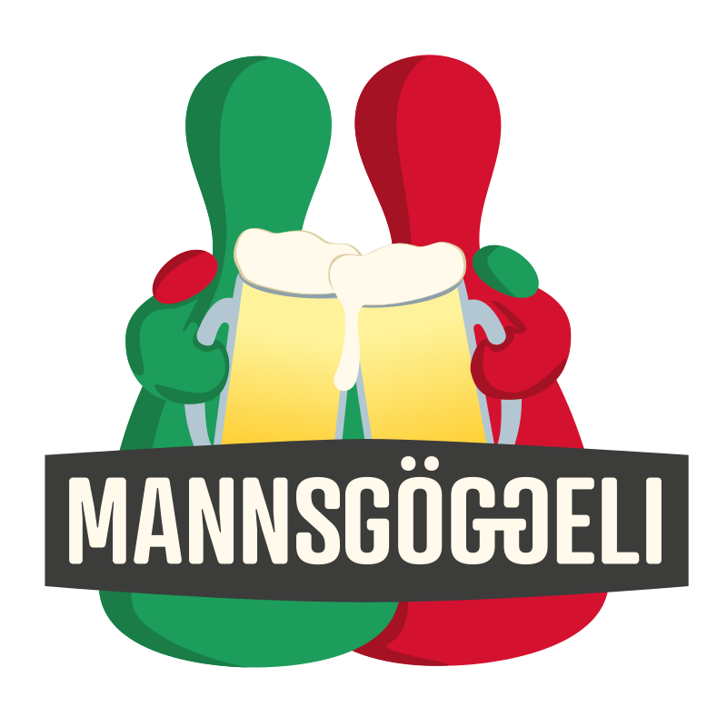
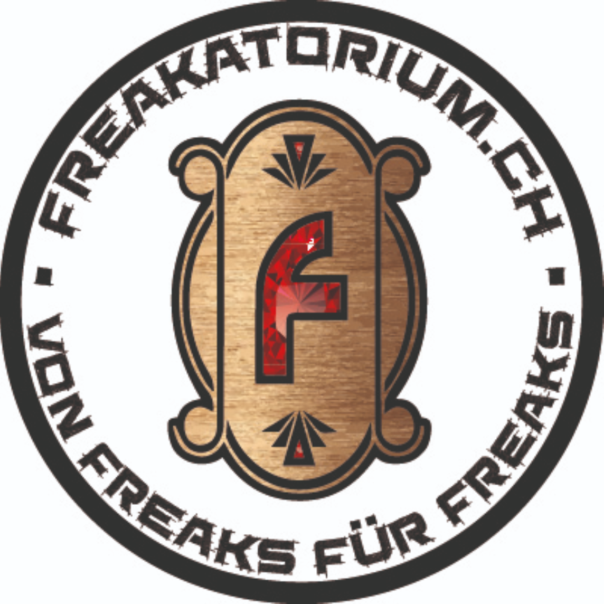
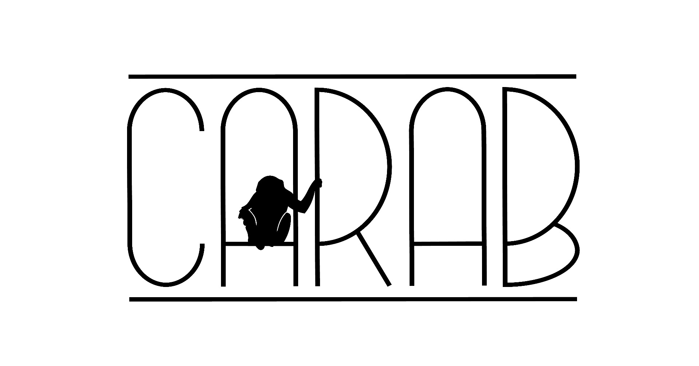

# Partner

[[toc]]

## Spielbude Zug









Wir haben uns zum Ziel gesetzt, die Zentralschweiz mit unserer Spiel-Euphorie anzustecken!

Unsere Kolleginnen und Kollegen von Zug bringen Spiele für die ganze Familie mit und werden diese am Sonntag, ab 11 Uhr gerne unseren Jüngsten Spieler:innen erklären.







## Gameorama &ndash; Interaktives Spielmuseum









Das Gameorama in Luzern ist ein schweizweit einmaliger Museum, in dem sich alles rund ums Thema Spielen dreht. Alles darf ausprobiert werden – von den über 600 Brettspielen im Brettspielcafé über Flipperkästen, Arcade-Automaten bis hin zu Spielkonsolen.

Das Gameorama organisiert am Sonntag, um 14 Uhr das Qualifikationsturnier für die KLASK-Schweizermeisterschaft.







## Mannsgöggeli









Wir lieben Spiel, Spannung und Spass und das am liebsten in bester Gesellschaft. Seit über 6 Jahren verwandeln wir deshalb Luzerner Locations in Spielparadiese.







## Freakatorium









Von Freaks für Freaks ist unser Motto, bei uns findest du alles was dein Nerd-, Geek-, Otaku- und Spieler-Herz begehrt!

Das Freakatorium sponsort einen Gutschein für den Wettbewerb an den Luzerner Spieltagen.







## Carab









Der Spielwarenladen für Magic the Gathering, YuGiOh, Dragon Ball Super, Pokémon und Digimon in Luzern.

Carab sponsort einen Gutschein für den Wettbewerb an den Luzerner Spieltagen.







## Gamers Point









Die kirchliche Jugendarbeit bietet mit dem GAMERS POINT einen Treff an, welcher kreative Jugendliche anspricht, die sonst gerne daheim an ihrem Computer gamen. Der GAMERS POINT setzt den Fokus nicht auf Computerspiele, sondern bietet eine riesige Sammlung von anspruchsvollen Gesellschaftspielen an.






