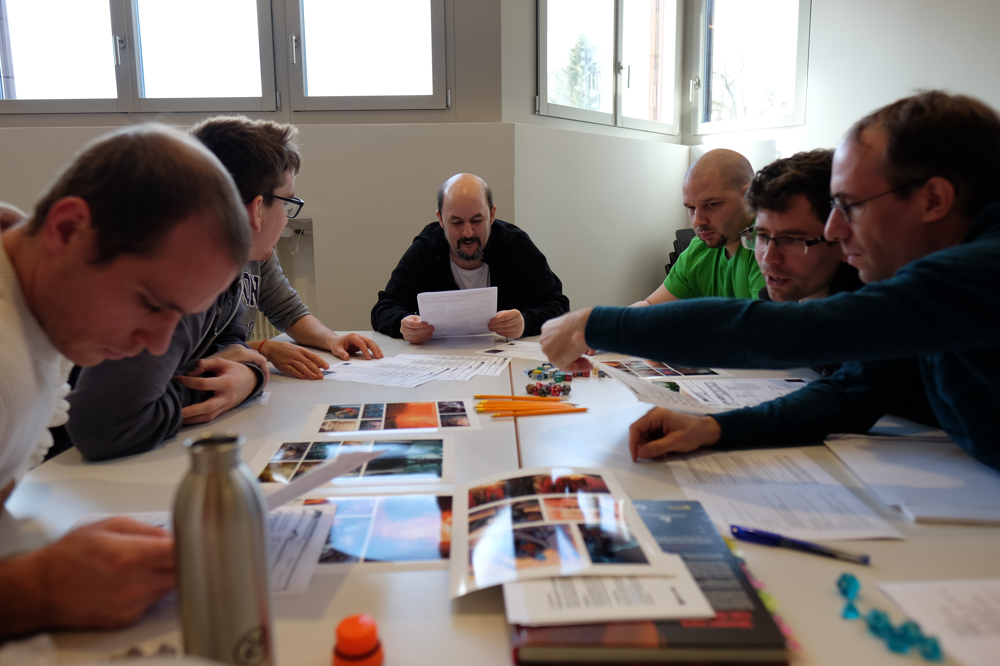
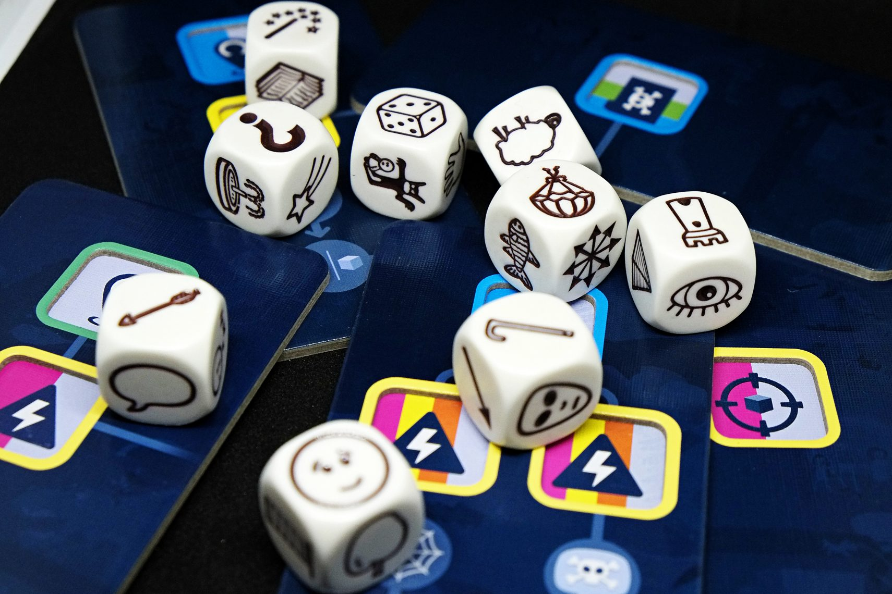
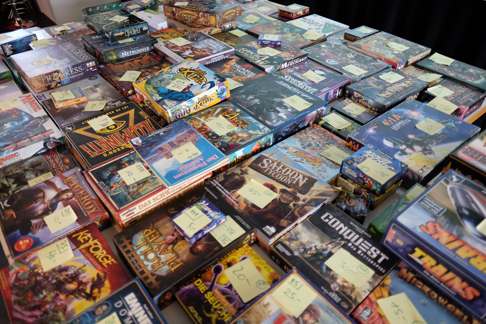
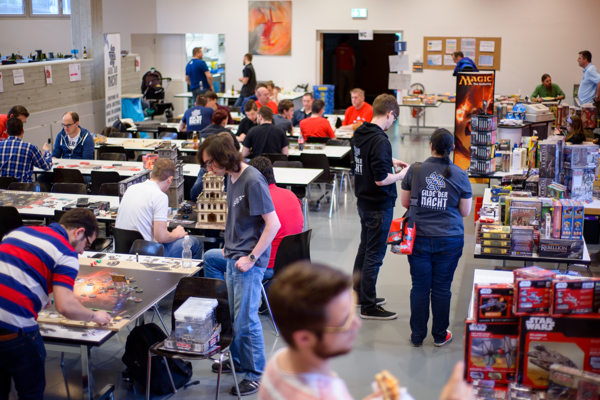
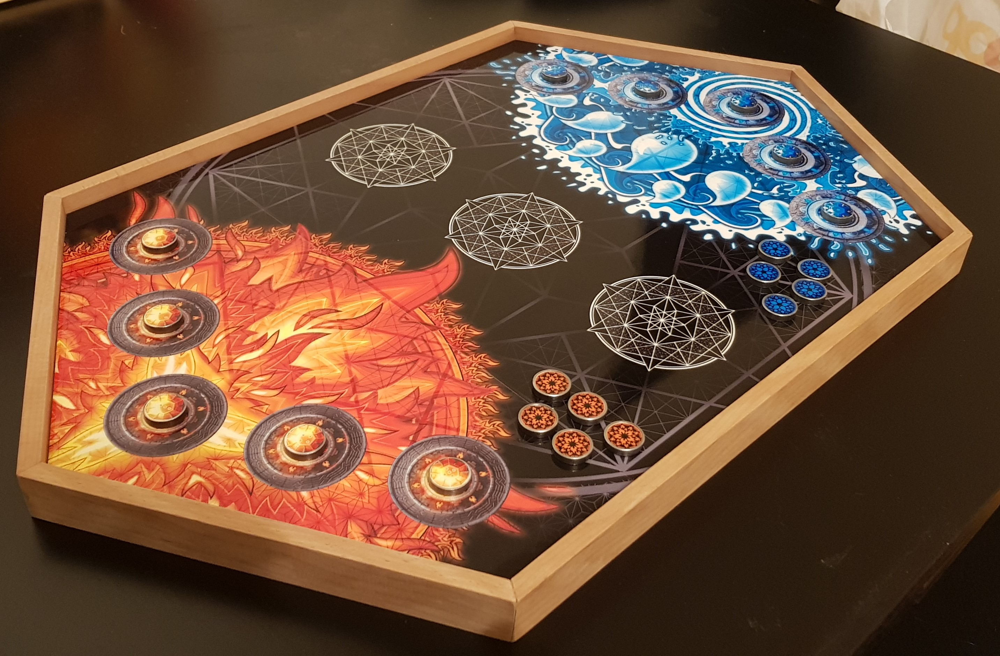
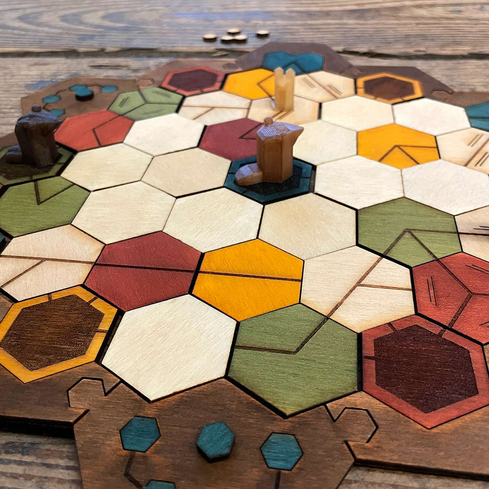

# Programm

**Öffnungszeiten**

Samstag, 9. März 2024, 10 bis 24 Uhr.\
Sonntag, 10. März 2024, 10 bis 18 Uhr.

Für ein abwechslungsreiches Programm ist an den Luzerner Spieltagen gesorgt:

[[toc]]




Hier kriegst du eine gute Übersicht, was dich an den Luzerner Spieltagen erwarten kann.



Am Sonntag bieten wir vieles für die kleinsten Spieler:innen an. Klicke hier, um mehr zu erfahren.



Für wiederkehrende Besucher haben wir hier eine Liste mit allen Neuerungen zusammengestellt.




## Spiele-Bibliothek

_Samstag + Sonntag_









Die grosse Bibliothek mit Spielen für Jung und Alt, für Strategen und Geniesser, für Einzel- oder Teamkämpfer steht im Fokus des Anlasses – entdecke mit uns Spiele, welche wir dir vor Ort erklären, ohne dass du das Regelbuch in die Hand nehmen musst.





## Erklärbären / Spielempfehlungen

_Samstag + Sonntag_









Wir haben dieses Jahr wieder eine Auswahl an Spielen, welche Erklärbären und Erklärbärinnen aus dem Effeff beherschen. Sieh dich nach den roten T-Shirts um, melde dich am Infopoint oder stöbere selber in unserer Bibliothek.





## Kinderspiele ab 3 Jahren

_Sonntag, 10. März 2024_





Unterstützt durch die Spielbude Zug und Ludothek Luzern.








Unsere Kolleginnen und Kollegen von der Spielbude Zug und Ludothek Luzern bringen Spiele für die ganze Familie mit und werden diese gerne unseren jüngsten Spieler:innen erklären. Eine super Gelegenheit, um neue Spiele kennen zu lernen.





## Rollenspiele

_Samstag, 9. März 2024, ab 13 Uhr_





_Beispiele der Rollenspiele: How to be a Hero, Tales from the Loop, Fiasco und Untold._





Tauche mit uns ein in die unendliche Welt der Phantasie, wo wir gemeinsam einzigartige Geschichten erleben werden. Wundervolle Geschichten, die wir zusammen spinnen und ab und zu Entscheidungen dem Glück überlassen, damit wir uns immer wieder von neuem überraschen und unterhalten lassen können.

Wenn du noch nie sogenannte Pen-&-Paper-Rollenspiele gespielt hast, wirst du bei uns Spielleiter finden, die dich in deinen ersten Schritten in diesem kreativen Hobby mit grossem Engagement unterstützen werden.




## Rollenspiele für Familien

_Sonntag, 10. März 2024, ab 13 Uhr_





_Beispiele der Rollenspiele: Fabelwelten, Es war einmal, Fabula Rasa Seemansgarn und Naeandis ._

Mehr Informationen haben wir [in diesem Artikel](https://gildedernacht.ch/artikel/familientisch/) für euch zusammengestellt.





Tauche als Familie mit Kindern jeden Alters ein in die Welt der Phantasie und des Geschichtenerzählens. Wir haben einfache Einstiege vorbereitet, um in minutenschnelle zu starten.





## Tabletop / Miniaturspiele

_Samstag + Sonntag_









In unserem Tabletop-Bereich kannst du Warhammer 40K-Luft schnuppern und mit Gleichgesinnten über Bastel- und Maltechniken plaudern.





## Flohmarkt

_Samstag + Sonntag_





Hast du vor mehr als fünf Spiele zu bringen, dann trag dich doch bitte in diese Liste ein:







Du möchtest deine persönliche Spielesammlung aufstocken? Kein Problem, stöbere in unserem Flohmarkt. Die eine oder andere Perle wirst du bestimmt finden.

Oder mache andern eine Freude indem du selbst Spiele anbietest welche du sowieso nicht mehr spielst. Der Flohmarkt wird von uns betreut und du kannst einfach sobald du gehst die übrig gebliebenen Spiele wieder Abholen.

_10% des Flohmarkt-Umsatzes gehen in die Vereinskasse der Organisatoren ([Gilde der Nacht](https://gildedernacht.ch/))._





## Verpflegung / Kiosk

_Samstag + Sonntag_









Ein Kiosk mit Getränken und Snacks steht während den Öffnungszeiten zur Verfügung und am Mittag und am Abend kochen wir etwas Leckeres für euch, inkl. Optionen für Veganer.

**Warme Küche**

- Samstag, 12 - 13 Uhr
- Samstag, 18 - 19 Uhr
- Sonntag, 12 - 13 Uhr

_Speisen und Getränke können Bar oder per Twint bezahlt werden._





## Klask-Turnier

_Sonntag, 10. März 2024, 14 Uhr_





Organisiert vom Gameorama, dem Interaktiven Spielmuseum in Luzern.







Bereits zum dritten Mal findet eines der Qualifikationsturniere für die KLASK-Schweizermeisterschaft an
den Luzerner Spieltagen statt.

Das Turnier ist für neue Spieler und Veteranen geeignet. Die Regeln sind einfach und die Runden kurz. Mitmachen ist gratis und die besten können sich sogar für die KLASK-Schweizermeisterschaft qualifizieren.

_Eine Anmeldung ist nicht erforderlich._





## Lange Spiele

_Samstag, 9. März 2024, 10 Uhr_









Du hast Lust auf ein extrem langes Brettspiel? Komm am Samstag direkt zur Türöffnung um 10 Uhr, um in ein episches Abenteuer mit Gleichgesinnten zu starten.

Dieses Jahr haben "Twilight Imperium: Vierte Edition" dabei. Besitzt du selbst ein längeres Spiel, von dem du die Regeln erklären kannst, welches du gerne auf den Tisch bringen würdest? Nimm Kontakt mit uns auf und wir reservieren dir einen Platz.





## Organisierte Spiele

_Samstag, 9. März 2024_









Am ganzen Samstag werden in einem separaten Raum Spiele veranstaltet, die für Action und Spannung stehen. Laute, tumultreiche oder aktive Spiele oder Spiele mit hoher Spieleranzahl finden dort ihren Platz.

Jede Spielrunde wird jeweils 5 Minuten früher über Mikrofon ausgerufen und wer Lust hat, kommt spontan dazu, ganz ohne Anmeldung. Das ist auch eine gute Gelegenheit, andere Mitspieler:innen zu finden, wenn du alleine gekommen bist.





## Spieldesigner «ScyDes»

_Samstag, 9. März 2024, ab 10 Uhr_\
_Sonntag, 10. März 2024, ab 14 Uhr_











Die kleine Spieleschmiede ScyDes bringt nach langem Warten endlich wieder Katapult-Action an die Spieltage!

Neben Walls of Scydonia kann auch der Prototyp des strategischen Geschicklichkeitsspiels KOR gespielt werden.





## Spieldesigner «Lamalandstudios»

_Samstag, 9. März 2024, ab 14 Uhr_\
_Sonntag, 10. März 2024, ab 10 Uhr_











«Lamaland Studios», so nennen wir uns, Dodo & Mely, zwei Game Design Alumni mit Sitz in Winterthur und im Sommer auch mal am See.

Noch sind wir mit «Badger», unserem ersten Brettspiel, in der Entwicklungsphase. Doch kurz bevor wir unaufhaltsam mit unserer handgemachten Produktion durchstarten, wollen wir euch an den Luzerner Spieletagen 2024 nochmal die Chance bieten, uns euer Feedback zu geben. Keine Sorge, wir spucken auch nicht, wir sind handzahme Lamas.






Ist dir das zu wenig Programm? Dann schau doch bei der Gilde der Nacht rein, den Organisatoren der Luzerner Spieltage.  Und merk dir unbedingt das Datum fürs nächste Jahr: **22. + 23. März 2025**.

