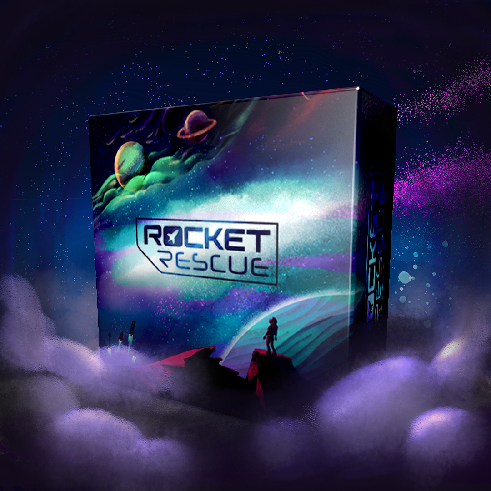

# Programm

**Öffnungszeiten**

Samstag, 11. März 2023, 10 bis 24 Uhr.\
Sonntag, 12. März 2023, 10 bis 18 Uhr.

Für ein abwechslungsreiches Programm ist an den Luzerner Spieltagen gesorgt:

[[toc]]

## Übersicht





|                 | Samstag, 11. März   |
| --------------: | ------------------- |
| **10&nbsp;Uhr** | Lange Spiele        |
| **11&nbsp;Uhr** | Groupmatching       |
| **12&nbsp;Uhr** | Mittagessen         |
|              |                  |
| **14&nbsp;Uhr** | Beginn Rollenspiele |
| **15&nbsp;Uhr** | Groupmatching       |
|              |                  |
| **17&nbsp;Uhr** | Nachtessen          |
|              |                  |





|                 | Sonntag, 12. März                              |
| --------------: | ---------------------------------------------- |
|              |                                             |
| **11&nbsp;Uhr** | Groupmatching Beginn Programm Kinderspiele |
| **12&nbsp;Uhr** | Mittagessen                                    |
| **13&nbsp;Uhr** | Beginn Rollenspiele für Familien               |
| **14&nbsp;Uhr** | Klask-Turnier                                  |
|              |                                             |





## Spiele-Bibliothek

_Samstag + Sonntag_









Die grosse Bibliothek mit Spielen für Jung und Alt, für Strategen und Geniesser, für Einzel- oder Teamkämpfer steht im Fokus des Anlasses – entdecke mit uns Spiele, welche wir dir vor Ort erklären, ohne dass du das Regelbuch in die Hand nehmen musst.





## Erkärbären / Spielempfehlungen

_Samstag + Sonntag_









Wir haben dieses Jahr wieder eine Auswahl an Spielen, welche Erklärbären und Erklärbärinnen aus dem Effeff beherschen. Sieh dich nach den roten T-Shirts um, melde dich am Infopoint oder stöbere selber in unserer Bibliothek.

Unsere Spielempfehlungen an diese Spieltagen sind: _Die Knuffies, Brass Birmingham, Mindbug, Aufbruch zum roten Planeten, Keep the Heroes out!, Sea Salt & Paper, Century: Golem Edition und Top Ten._





## Kinderspiele ab 3 Jahren

_Sonntag, 12. März 2023, ab 11 Uhr_





Organisiert von der Spielbude Zug.






Unsere Kolleginnen und Kollegen von Zug bringen Spiele für die ganze Familie mit und werden diese ab 11 Uhr gerne unseren Jüngsten Spieler:innen erklären. Eine super Gelegenheit, um neue Spiele kennen zu lernen.





## Rollenspiele

_Samstag, 11. März 2023, ab 14 Uhr_









Tauche mit uns ein in die unendliche Welt der Phantasie, wo wir gemeinsam einzigartige Geschichten erleben werden. Wundervolle Geschichten, die wir zusammen spinnen und ab und zu Entscheidungen dem Glück überlassen, damit wir uns immer wieder von neuem überraschen und unterhalten lassen können.

Wenn du noch nie sogenannte Pen-&-Paper-Rollenspiele gespielt hast, wirst du bei uns Spielleiter finden, die dich in deinen ersten Schritten in diesem kreativen Hobby mit grossem Engagement unterstützen werden.




## Rollenspiele für Familien

_Sonntag, 12. März 2023, ab 13 Uhr_









Tauche als Familie mit Kindern jeden Alters ein in die Welt der Phantasie und des Geschichtenerzählens. Wir haben einfache Einstiege vorbereitet, um in minutenschnelle zu starten.





## Tabletop / Miniaturspiele

_Samstag + Sonntag_









In unserem Tabletop-Bereich kannst du Warhammer 40K testen und mit Gleichgesinnten über Bastel- und Maltechniken plaudern.





## Flohmarkt

_Samstag + Sonntag_





Hast du vor mehr als fünf Spiele zu bringen, dann trag dich doch bitte in diese Liste ein:







Du möchtest deine persönliche Spielesammlung aufstocken? Kein Problem, stöbere in unserem Flohmarkt. Die eine oder andere Perle wirst du bestimmt finden.

Oder mache andern eine Freude indem du selbst Spiele anbietest welche du sowieso nicht mehr spielst. Der Flohmarkt wird von uns betreut und du kannst einfach sobald du gehst die übrig gebliebenen Spiele wieder Abholen.

_10% des Flohmarkt-Umsatzes gehen in die Vereinskasse der Organisatoren ([Gilde der Nacht](https://gildedernacht.ch/))._





## Verpflegung / Kiosk

_Samstag + Sonntag_









Ein Kiosk mit Getränken und Snacks steht während den Öffnungszeiten zur Verfügung und am Mittag und am Abend kochen wir etwas Leckeres für euch, inkl. Optionen für Veganer.

**Warme Küche**

- Samstag, 12 - 13 Uhr
- Samstag, 18 - 19 Uhr
- Sonntag, 12 - 13 Uhr

_Speisen und Getränke können Bar oder per Twint bezahlt werden._





## Klask-Turnier

_Sonntag, 12. März 2023, 14 Uhr_





Organisiert vom Gameorama, dem Interaktiven Spielmuseum in Luzern.







Bereits zum zweiten Mal findet eines der Qualifikationsturniere für die KLASK-Schweizermeisterschaft an
den Luzerner Spieltagen statt.

Das Turnier ist für neue Spieler und Veteranen geeignet. Die Regeln sind einfach und die Runden kurz. Mitmachen ist gratis und die besten können sich sogar für die KLASK-Schweizermeisterschaft qualifizieren.

_Eine Anmeldung ist nicht erforderlich._





## Lange Spiele

_Samstag, 11. März 2023, 10 Uhr_









Du hast Lust auf ein extrem langes Brettspiel, aber in deinem privaten Umfeld findest du einfach keine Mitspielende die sich darauf einlassen? Komm am Samstag direkt zur **Türöffnung um 10 Uhr**, um in ein episches Abenteuer mit Gleichgesinnten zu starten.

Wir haben einige lange Spiele dabei, du darfst aber auch gerne deinen eigenen Favorit mitnehmen. Sei bitte einfach erklärfest.





## Groupmatching

_Samstag, 11. März 2023, 11 Uhr_\
_Samstag, 11. März 2023, 15 Uhr_\
_Sonntag, 12. März 2023, 11 Uhr_









Du kommst alleine oder ihr kommt in einer kleinen Gruppe und seid euch nicht sicher, wie alles funktioniert? Dann melde dich doch zu unseren speziellen Groupmatching Zeitpunkten (Samstag, 11 und 15 Uhr und Sonntag, 11 Uhr) am Infopoint um Gruppen zu bilden, interessante Spiele erklärt bekommen und neue Spieler:innen kennenzulernen.





## Spieldesigner «Rocket Rescue»

_Samstag + Sonntag_











Spiele eine Demorunde mit den Spiel-Designern von Rocket Rescue. Rocket Rescue ist ein Strategie-Kennerspiel für 3-5 Spieler. Eine Partie dieses anspruchsvollen aber leicht zu erlernendes Spiel dauert ca. 90-120 min.




