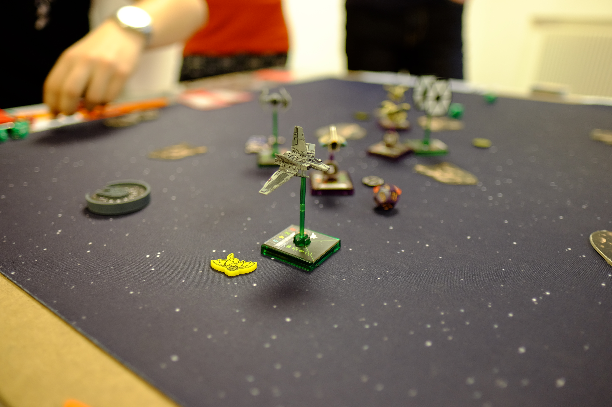

# Programm

Für ein abwechslungsreiches Programm ist an den Luzerner Spieltagen gesorgt:

[[toc]]

## Karten- und Brettspiele

Die grosse Bibliothek mit Spielen für Jung und Alt, für Strategen und Geniesser, für Einzel- oder Teamkämpfer steht im Fokus des Anlasses – entdecke mit uns Spiele, welche wir dir vor Ort erklären, ohne dass du das Regelbuch in die Hand nehmen musst.

### Kinder & Familien

_10 bis 17 Uhr_

Die [Spielbude Zug](https://www.spielbude.ch/zug) bringt Kinderspiele für die Altersgruppe drei bis sieben Jahre mit.

### Klask-Turnier

_14 bis 16 Uhr_

Das [Gameorama (Interaktives Spielmuseum)](https://www.gameorama.ch/) organisiert an den Spieltagen ein Klask-Turnier, an dem spannende Preise gewonnen werden können.

Anmeldung vor Ort. Teilnahme kostenlos. Keine Altersbeschränkungen.

### Spiel-Demo: HEROPOLIS

_10 bis 17 Uhr_

In der Welt von [Heropolis](https://www.spielpraxis.ch/) schlüpft ihr in die Haut eines witzigen Comic-Helden, entdeckt längst verlassene Quartiere und stampft eine komplett neue Metropole aus dem Boden!

## Rollenspiele

Tauche mit uns ein in die unendliche Welt der Phantasie, wo wir gemeinsam einzigartige Geschichten erleben werden. Wundervolle Geschichten, die wir zusammen spinnen und ab und zu Entscheidungen dem Glück überlassen, damit wir uns immer wieder von neuem überraschen und unterhalten lassen können.

Wenn du noch nie sogenannte Pen-&-Paper-Rollenspiele gespielt hast, wirst du bei uns Spielleiter finden, die dich in deinen ersten Schritten in diesem kreativen Hobby mit grossem Engagement unterstützen werden.

## Tabletop / Miniaturspiele

In unserem Tabletop-Bereich kannst du Warhammer 40K testen und mit Gleichgesinnten über Bastel- und Maltechniken plaudern.

## Flohmarkt

Du möchtest deine persönliche Spielesammlung aufstocken? Kein Problem, stöbere in unserem Flohmarkt. Die eine oder andere Perle wirst du bestimmt finden.

Oder bring deine Spiele mit, die du sowieso nicht mehr spielst und finde bei uns ein neues Zuhause?


Möchtest du mehr als **fünf Spiele** im Flohmarkt platzieren, sind wir dir dankbar, wenn du uns bereits vor dem Event deine Spiele mitteilst.


_10% des Flohmarkt-Umsatzes gehen in die Vereinskasse der Organisatoren ([Gilde der Nacht](https://gildedernacht.ch/))._

